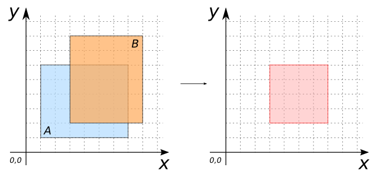
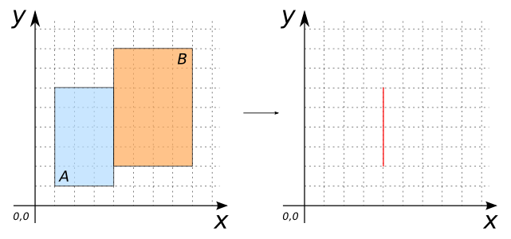
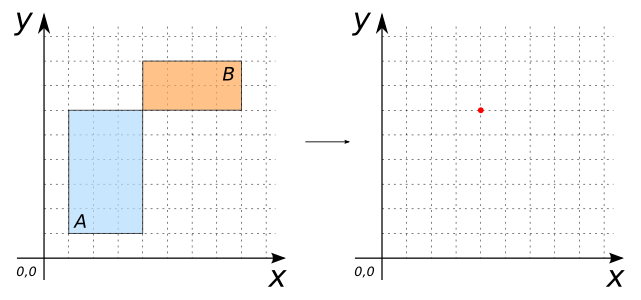
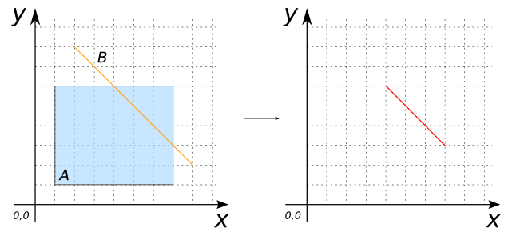
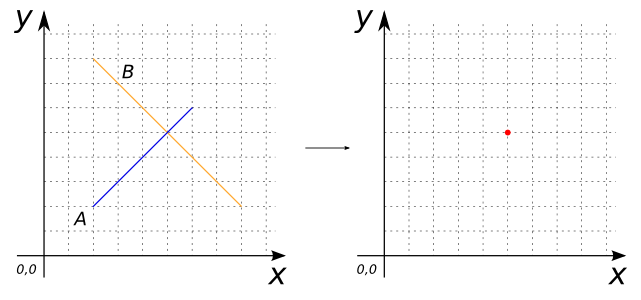
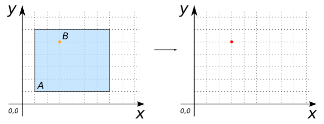

### Signatures


GEOMETRY ST_Intersection(GEOMETRY geomA, GEOMETRY geomB)


### Description

Computes the intersection between `geomA` and `geomB`.

`geomA` and `geomB` can be `POINT`s, `LINESTRING`s, `POLYGON`s or `GEOMETRYCOLLECTION`s



### Examples

| geomA POLYGON                       | geomB POLYGON                       |
|-------------------------------------|-------------------------------------|
| POLYGON((1 1, 7 1, 7 6, 1 6, 1 1))  | POLYGON((3 2, 8 2, 8 8, 3 8, 3 2))  |


SELECT ST_Intersection(geomA, geomB) FROM input_table;
-- Answer:    POLYGON((3 6, 7 6, 7 2, 3 2, 3 6))


| geomA POLYGON                       | geomB POLYGON                       |
|-------------------------------------|-------------------------------------|
| POLYGON((1 1, 4 1, 4 6, 1 6, 1 1))  | POLYGON((4 2, 8 2, 8 8, 4 8, 4 2))  |


SELECT ST_Intersection(geomA, geomB) FROM input_table;
-- Answer:    LINESTRING(4 2, 4 6)


| geomA POLYGON                       | geomB POLYGON                       |
|-------------------------------------|-------------------------------------|
| POLYGON((1 1, 4 1, 4 6, 1 6, 1 1))  | POLYGON((4 6, 8 6, 8 8, 4 8, 4 6))  |


SELECT ST_Intersection(geomA, geomB) FROM input_table;
-- Answer:    POINT(4 6)


| geomA POLYGON                       | geomB LINESTRING      |
|-------------------------------------|-----------------------|
| POLYGON((1 1, 7 1, 7 6, 1 6, 1 1))  | LINESTRING(2 8, 8 2)  |


SELECT ST_Intersection(geomA, geomB) FROM input_table;
-- Answer:    LINESTRING(4 6, 7 3)


| geomA LINESTRING      | geomB LINESTRING      |
|-----------------------|-----------------------|
| LINESTRING(2 2, 6 6)  | LINESTRING(2 8, 8 2)  |


SELECT ST_Intersection(geomA, geomB) FROM input_table;
-- Answer:    POINT(5 5)


| geomA POLYGON                       | geomB POINT |
|-------------------------------------|-------------|
| POLYGON((1 1, 7 1, 7 6, 1 6, 1 1))  | POINT(3 5)  |


SELECT ST_Intersection(geomA, geomB) FROM input_table;
-- Answer:    POINT(3 5)


##### See also

* <a href="https://github.com/orbisgis/h2gis/blob/v1.2.4/h2spatial/src/main/java/org/h2gis/h2spatial/internal/function/spatial/operators/ST_Intersection.java" target="_blank">Source code</a>
