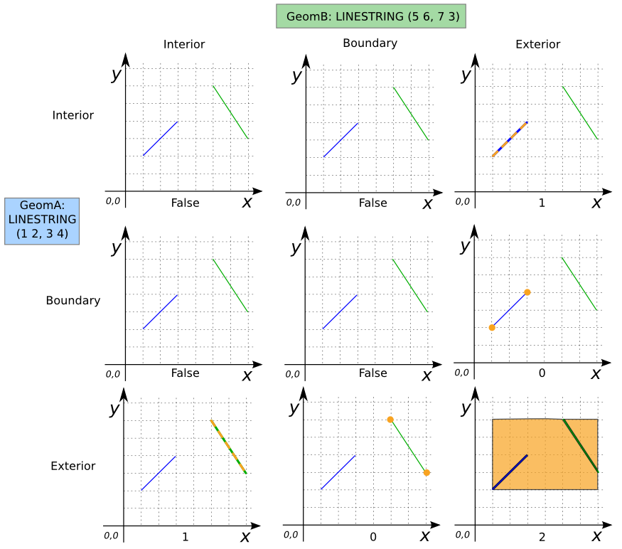
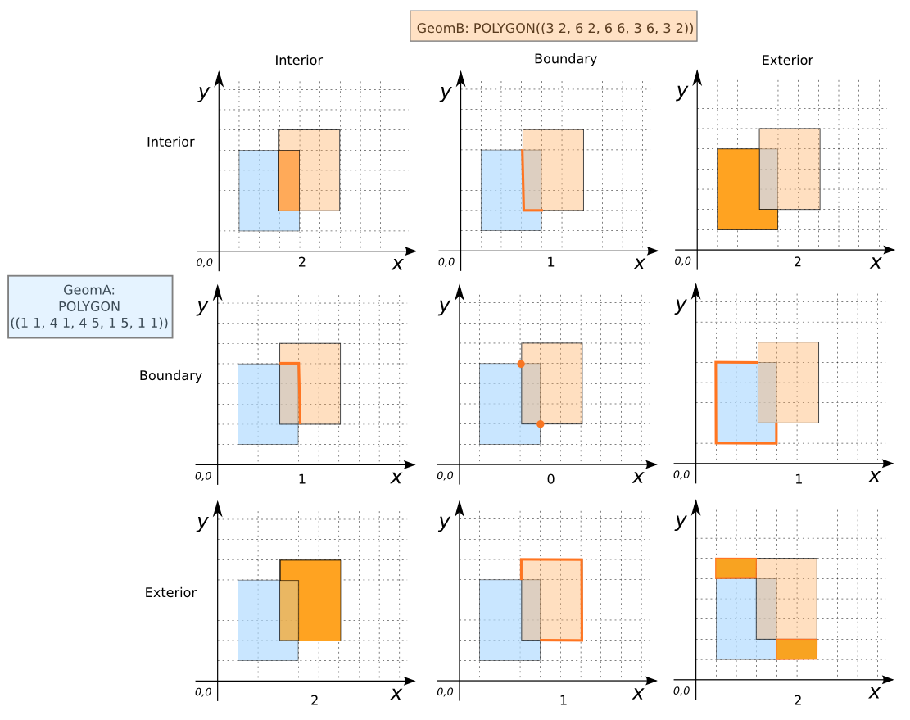

### Signatures


VARCHAR ST_Relate(GEOMETRY geomA, GEOMETRY geomB);
BOOLEAN ST_Relate(GEOMETRY geomA, GEOMETRY geomB, VARCHAR iMatrix);


### Description

Returns

* the [DE-9IM][] intersection matrix
for `geomA` and `geomB`, or
* `TRUE` if `geomA` and `geomB` are related by the intersection matrix
  specified by `iMatrix`.





### Examples


SELECT ST_Relate('LINESTRING(1 2, 3 4)',
                 'LINESTRING(5 6, 7 3)');
-- Answer: FF1FF0102



SELECT ST_Relate('POLYGON((1 1, 4 1, 4 5, 1 5, 1 1))',
                 'POLYGON((3 2, 6 2, 6 6, 3 6, 3 2))');
-- Answer: 212101212



SELECT ST_Relate('POLYGON((1 1, 4 1, 4 5, 1 5, 1 1))',
                 'POLYGON((3 2, 6 2, 6 6, 3 6, 3 2))',
                 '212101212');
-- Answer: TRUE

SELECT ST_Relate('POLYGON((1 1, 4 1, 4 5, 1 5, 1 1))',
                 'POLYGON((3 2, 6 2, 6 6, 3 6, 3 2))',
                 '112101212');
-- Answer: FALSE

-- Note: * indicates that all values are accepted.
SELECT ST_Relate('POINT(1 2)', ST_Buffer('POINT(1 2)', 2),
                 '0F*FFF212');
-- Answer: TRUE


##### See also

* [`ST_Contains`](../ST_Contains), [`ST_Covers`](../ST_Covers), [`ST_Crosses`](../ST_Crosses), [`ST_Disjoint`](../ST_Disjoint),
 [`ST_Equals`](../ST_Equals), [`ST_Intersects`](../ST_Intersects),
 [`ST_Overlaps`](../ST_Overlaps), [`ST_Touches`](../ST_Touches),
 [`ST_Within`](../ST_Within),
* <a href="https://github.com/orbisgis/h2gis/blob/master/h2spatial/src/main/java/org/h2gis/h2spatial/internal/function/spatial/predicates/ST_Relate.java" target="_blank">Source code</a>

[DE-9IM]: http://en.wikipedia.org/wiki/DE-9IM
