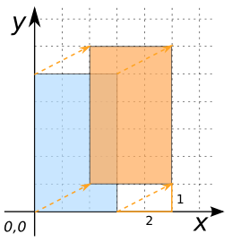

### Signature


GEOMETRY ST_Translate(GEOMETRY geom, DOUBLE x, DOUBLE y);
GEOMETRY ST_Translate(GEOMETRY geom, DOUBLE x, DOUBLE y, DOUBLE z);


### Description

Translates `geom` by the vector (`x`, `y`) or (`x`, `y`, `z`).

  <h5>Cannot translate geometries of mixed dimension.</h5>
  
<code>LINESTRING(0 0, 1 0 0)</code> cannot be translated
  because its second coordinate has a <i>z</i>-value while its first
  coordinate does not.

### Examples


SELECT ST_Translate('POLYGON((0 0, 3 0, 3 5, 0 5, 0 0))', 2, 1);
-- Answer: POLYGON((2 1, 5 1, 5 6, 2 6, 2 1))



SELECT ST_Translate('POINT(1 2 3)', 10, 20, 30);
-- Answer: POINT(11 22 33)

-- Doing a 3D translation on a 2D Geometry is the same as doing a 2D
-- translation:
SELECT ST_Translate('LINESTRING(0 0, 1 0)', 1, 2, 3);
-- Answer: LINESTRING(1 2, 2 2)

-- Doing a 2D translation on a 3D Geometry leaves z-values
-- unchanged:
SELECT ST_Translate('LINESTRING(0 0 0, 1 0 0)', 1, 2);
-- Answer: LINESTRING(1 2 0, 2 2 0)

SELECT ST_Translate('LINESTRING(-71.01 42.37, -71.11 42.38)',
                    1, 0.5);
-- Answer: LINESTRING(-70.01 42.87, -70.11 42.88)

SELECT ST_Translate('MULTIPOINT((0 1), (2 2), (1 3))', 1, 0);
-- Answer: MULTIPOINT((1 1), (3 2), (2 3))

SELECT ST_Translate('GEOMETRYCOLLECTION(
                        POLYGON((0 0, 3 5, 6  6, 0 7, 0 0)),
                        MULTIPOINT((0 1), (2 2), (1 3)))', -1, 1);
-- Answer: GEOMETRYCOLLECTION(POLYGON((-1 1, 2 6, 5 7, -1 8, -1 1)),
--                            MULTIPOINT((-1 2), (1 3), (0 4)))


##### Non-examples


SELECT ST_Translate(NULL, 1, 2),
-- Answer: NULL

SELECT ST_Translate(NULL, 1, 2, 3);
-- Answer: NULL

SELECT ST_Translate('LINESTRING(0 0, 1 0 0)', 1, 2);
-- ERROR: Cannot translate geometries of mixed dimension

SELECT ST_Translate('LINESTRING(0 0, 1 0 0)', 1, 2, 3);
-- ERROR: Cannot translate geometries of mixed dimension


##### See also

* [`ST_Rotate`](../ST_Rotate)
* <a href="https://github.com/orbisgis/h2gis/blob/master/h2gis-functions/src/main/java/org/h2gis/functions/spatial/affine_transformations/ST_Translate.java" target="_blank">Source code</a>
