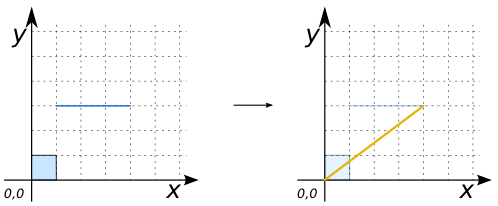
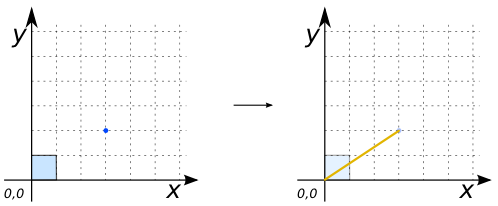
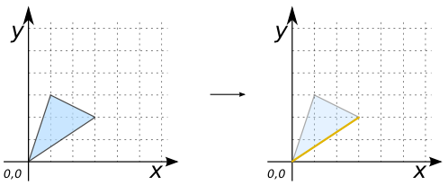

### Signature


LINESTRING ST_LongestLine(GEOMETRY geomA, GEOMETRY geomB);


### Description

Returns the 2-dimensional longest `LINESTRING` between the points of two geometries (`geomA` and `geomB`).

If `geomA` and `geomB` are the same, the function will return the longest `LINESTRING` between the two farthest vertices in this geometry.

### Examples

##### Cases where `geomA` and `geomB` are different


SELECT ST_Longestline('POLYGON ((0 1, 1 1, 1 0, 0 0, 0 1))', 
                      'POLYGON ((2 3, 2 2, 3 2, 4 3, 2 3))');
-- Answer: LINESTRING (0 0, 4 3)



SELECT ST_Longestline('POLYGON ((0 1, 1 1, 1 0, 0 0, 0 1))', 
		      'LINESTRING (1 3, 4 3)');
-- Answer: LINESTRING (0 0, 4 3)



SELECT ST_Longestline('POLYGON ((0 1, 1 1, 1 0, 0 0, 0 1))', 
		      'POINT (3 2)');
-- Answer: LINESTRING (0 0, 3 2)



SELECT ST_Longestline('MULTIPOLYGON (((0 1, 1 1, 1 0, 0 0, 0 1)), 
				    ((2 3, 2 2, 3 3, 2 3)))', 
		      'POINT (3 2)');
-- Answer: LINESTRING (0 0, 3 2)


##### Case where `geomA` is equal to `geomB`


SELECT ST_Longestline('POLYGON ((1 3, 0 0, 3 2, 1 3))', 
		      'POLYGON ((1 3, 0 0, 3 2, 1 3))');
-- Answer: LINESTRING (0 0, 3 2)


##### See also

* [`ST_MaxDistance`](../ST_MaxDistance), [`ST_ClosestCoordinate`](../ST_ClosestCoordinate)
* <a href="https://github.com/orbisgis/h2gis/blob/master/h2gis-functions/src/main/java/org/h2gis/functions/spatial/distance/ST_LongestLine.java" target="_blank">Source code</a>
