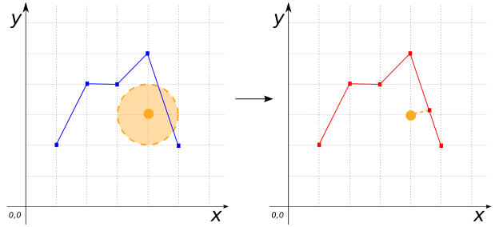
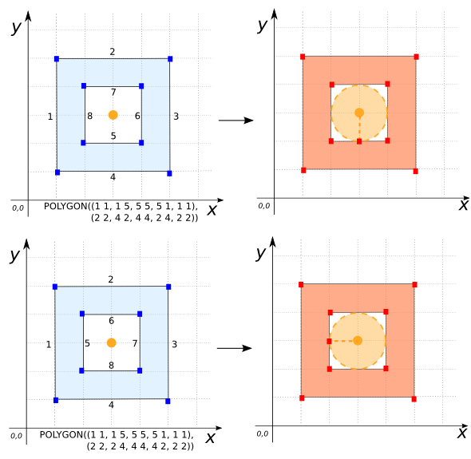
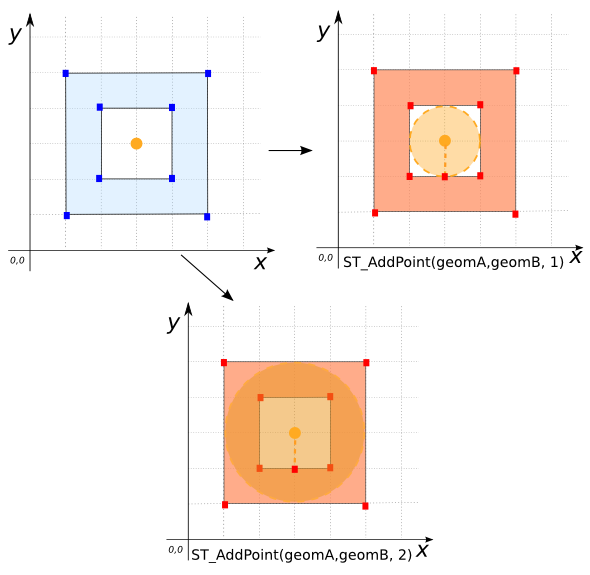

### Signature


GEOMETRY ST_AddPoint(GEOMETRY geom, POINT point);
GEOMETRY ST_AddPoint(GEOMETRY geom, POINT point, DOUBLE tolerance);


### Description

Snaps `point` to `geom` if it is within a distance of `tolerance` of
`geom`.  If no `tolerance` is given, a default of `10E-6` is used.
If there are several candidates within a minimal distance, snaps `point`
to the first one found.

### Examples


SELECT ST_AddPoint('POINT(0 0)', 'POINT(1 1)');
-- Answer: NULL

SELECT ST_AddPoint('MULTIPOINT((0 0), (3 3))', 'POINT(1 1)');
-- Answer: MULTIPOINT((0 0), (3 3), (1 1))

SELECT ST_AddPoint('LINESTRING(1 2, 2 4, 3 4, 4 5, 5 2)',
                   'POINT(4 3)', 1);
-- Answer: LINESTRING(1 2, 2 4, 3 4, 4 5, 4.6 3.2, 5 2)



-- Note: The point added depends on the input geometry's coordinate
-- order.
SELECT ST_AddPoint('POLYGON((1 1, 1 5, 5 5, 5 1, 1 1),
                            (2 2, 4 2, 4 4, 2 4, 2 2))',
                   'POINT(3 3)', 1);
-- Answer: POLYGON((1 1, 1 5, 5 5, 5 1, 1 1),
--                  (2 2, 3 2, 4 2, 4 4, 2 4, 2 2))

SELECT ST_AddPoint('POLYGON((1 1, 1 5, 5 5, 5 1, 1 1),
                            (2 2, 2 4, 4 4, 4 2, 2 2))',
                   'POINT(3 3)', 1);
-- Answer: POLYGON((1 1, 1 5, 5 5, 5 1, 1 1),
--                  (2 2, 2 3, 2 4, 4 4, 4 2, 2 2))



CREATE TABLE input(poly POLYGON, p POINT);
INSERT INTO input VALUES ('POLYGON((1 1, 1 5, 5 5, 5 1, 1 1),
                                  (2 2, 4 2, 4 4, 2 4, 2 2))',
                         'POINT(3 3)');

SELECT ST_AddPoint(poly, p, 0.5) FROM input;
-- Answer: POLYGON((1 1, 1 5, 5 5, 5 1, 1 1),
--                 (2 2, 4 2, 4 4, 2 4, 2 2))

-- Note: In the next two examples, the result is the same regardless of
-- the tolerance.
SELECT ST_AddPoint(poly, p, 1) FROM input;
-- Answer: POLYGON((1 1, 1 5, 5 5, 5 1, 1 1),
--                 (2 2, 3 2, 4 2, 4 4, 2 4, 2 2))

SELECT ST_AddPoint(poly, p, 2) FROM input;
-- Answer: POLYGON((1 1, 1 5, 5 5, 5 1, 1 1),
--                 (2 2, 3 2, 4 2, 4 4, 2 4, 2 2))


##### See also

* [`ST_RemovePoints`](../ST_RemovePoints), [`ST_Densify`](../ST_Densify)
* <a href="https://github.com/orbisgis/h2gis/blob/master/h2spatial-ext/src/main/java/org/h2gis/h2spatialext/function/spatial/edit/ST_AddPoint.java" target="_blank">Source code</a>
