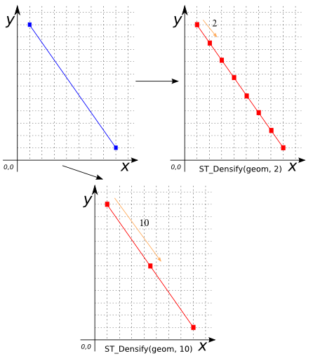

### Signature


GEOMETRY ST_Densify(GEOMETRY geom, DOUBLE tolerance);


### Description

Densifies `geom` by inserting extra vertices along the line segments
it contains using a distance `tolerance`.

### Examples


-- Points are invariant under densification
SELECT ST_Densify('POINT(14 2)', 10);
-- Answer: POINT(14 2)

SELECT ST_Densify('LINESTRING(1 11, 8 1)', 2);
-- Answer: LINESTRING(1 11, 2 9.5714, 3 8.1428,
--                    4 6.7142, 5 5.2857, 6 3.85714,
--                    7 2.4285, 8 1)

SELECT ST_Densify('LINESTRING(1 11, 8 1)', 10);
-- Answer: LINESTRING(1 11, 4.5 6, 8 1)



SELECT ST_Densify('POLYGON((2 0, 2 8, 4 8, 4 0, 2 0))', 4.5)
-- Answer: POLYGON((2 0, 2 4, 2 8, 4 8, 4 4, 4 0, 2 0))


##### See also

* <a href="https://github.com/orbisgis/h2gis/blob/master/h2spatial-ext/src/main/java/org/h2gis/h2spatialext/function/spatial/edit/ST_Densify.java" target="_blank">Source code</a>
* JTS [Densifier#densify][jts]

[jts]: http://tsusiatsoftware.net/jts/javadoc/com/vividsolutions/jts/densify/Densifier.html#densify(com.vividsolutions.jts.geom.Geometry, double)
