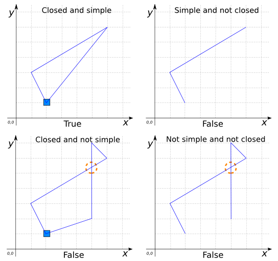

### Signature


BOOLEAN ST_IsRing(GEOMETRY geom);


### Description

Return `TRUE` if `geom` is a closed and simple `LINESTRING` or
`MULTILINESTRING`; `NULL` otherwise.



### Examples


SELECT ST_IsRing('LINESTRING(2 1, 1 3, 6 6, 2 1)');
-- Answer: TRUE

SELECT ST_IsRing('LINESTRING(2 1, 1 3, 6 6)');
-- Answer: FALSE

SELECT ST_IsRing('LINESTRING(2 1, 1 3, 6 6, 5 7, 5 2, 2 1)');
-- Answer: FALSE

SELECT ST_IsRing('LINESTRING(2 1, 1 3, 6 6, 5 7, 5 2)');
-- Answer: FALSE



SELECT ST_IsRing('MULTILINESTRING((0 2, 3 2, 3 6, 0 6, 0 2),
                                  (5 0, 7 0, 7 1, 5 1, 5 0))');
-- Answer: TRUE

SELECT ST_IsRing('MULTILINESTRING((0 2, 3 2, 3 6, 0 6, 0 1),
                                  (5 0, 7 0, 7 1, 5 1, 5 0))');
-- Answer: FALSE


##### See also

* [`ST_IsClosed`](../ST_IsClosed), [`ST_IsSimple`](../ST_IsSimple),
  [`ST_StartPoint`](../ST_StartPoint), [`ST_EndPoint`](../ST_EndPoint)
* <a href="https://github.com/orbisgis/h2gis/blob/v1.3.0/h2gis-functions/src/main/java/org/h2gis/functions/spatial/properties/ST_IsRing.java" target="_blank">Source code</a>
