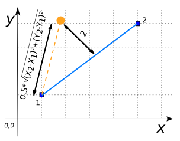
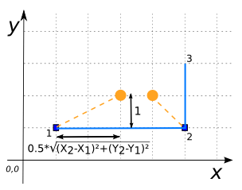
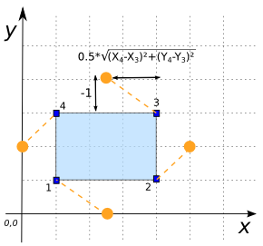
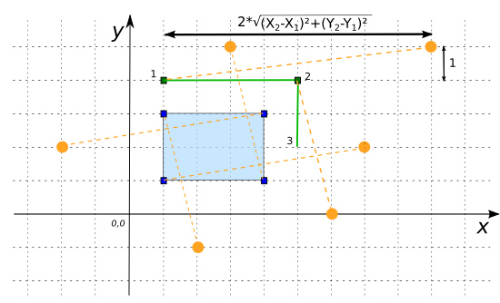

### Signature


MULTIPOINT ST_LocateAlong(GEOMETRY geom,
                          DOUBLE segmentLengthFraction,
                          DOUBLE offsetDistance);


### Description

Places points along the line segments composing `geom` at a distance of
`segmentLengthFraction` along the segment and at an offset distance of
`offsetDistance`. Returns them as a `MULTIPOINT`.

  <h5>What about orientation?</h5>
  
Line segment orientation is determined by the order of the coordinates. A
  positive offset places the point to the left of the segment; a negative
  offset to the right.

  <h5>Only exterior rings are supported for <code>POLYGON</code>s.</h5>

### Examples


SELECT ST_LocateAlong('LINESTRING(1 1, 5 4)', 0.5, 2);
-- Answer: MULTIPOINT((1.8 4.1))



SELECT ST_LocateAlong('LINESTRING(1 1, 5 1, 5 3)', 0.5, 1);
-- Answer: MULTIPOINT((3 2), (4 2))



SELECT ST_LocateAlong('POLYGON((1 1, 4 1, 4 3, 1 3, 1 1))', 0.5, -1);
-- Answer: MULTIPOINT((2.5 0), (5 2), (2.5 4), (0 2))



SELECT ST_LocateAlong('GEOMETRYCOLLECTION(
                           LINESTRING(1 4, 5 4, 5 2),
                           POLYGON((1 1, 4 1, 4 3, 1 3, 1 1)))',
                      2, 1);
-- Answer: MULTIPOINT((2 -1), (-2 2), (6 0), (9 5), (7 2), (3 5))


##### See also

* <a href="https://github.com/orbisgis/h2gis/blob/v1.3.0/h2gis-functions/src/main/java/org/h2gis/functions/spatial/distance/ST_LocateAlong.java" target="_blank">Source code</a>
