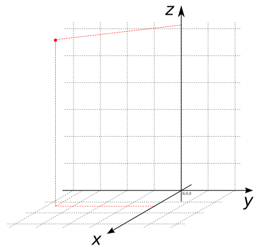

### Signatures


POINT ST_MakePoint(DOUBLE x, DOUBLE y);
POINT ST_MakePoint(DOUBLE x, DOUBLE y, DOUBLE z);


### Description

Constructs a `POINT` from `x` and `y` (and possibly `z`).

### Examples


SELECT ST_MakePoint(1.4, -3.7);
-- Answer:     POINT(1.4 -3.7)



SELECT ST_MakePoint(1.4, -3.7, 6.2);
-- Answer:     POINT(1.4 -3.7 6.2)


##### See also

* <a href="https://github.com/orbisgis/h2gis/blob/master/h2spatial-ext/src/main/java/org/h2gis/h2spatialext/function/spatial/create/ST_MakePoint.java" target="_blank">Source code</a>
