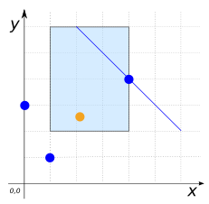

### Signature


POINT ST_InteriorPoint(GEOMETRY geom);


### Description

Returns an interior point of `geom`, if it possible to calculate such a point.
Otherwise, returns a point on the boundary of `geom`.

The point returned is always the same for the same input Geometry.



### Examples


SELECT ST_PointOnSurface('POINT(1 5)');
-- Answer: POINT(1 5)

SELECT ST_PointOnSurface('MULTIPOINT((4 4), (1 1), (1 0), (0 3)))');
-- Answer: POINT(1 1)

SELECT ST_PointOnSurface('LINESTRING(-1 5, 0 10)');
-- Answer: POINT(0 10)

SELECT ST_PointOnSurface('POLYGON((0 0, 0 5, 5 5, 5 0, 0 0))');
-- Answer: POINT(2.5 2.5)



SELECT ST_PointOnSurface('GEOMETRYCOLLECTION(
                             POLYGON((1 2, 4 2, 4 6, 1 6, 1 2)),
                             LINESTRING(2 6, 6 2),
                             MULTIPOINT((4 4), (1 1), (0 3)))');
-- Answer: POINT(2.5 4)


##### Comparison with [`ST_Centroid`](../ST_Centroid)



##### See also

* [`ST_Centroid`](../ST_Centroid)
* <a href="https://github.com/orbisgis/h2gis/blob/master/h2spatial/src/main/java/org/h2gis/h2spatial/internal/function/spatial/properties/ST_PointOnSurface.java" target="_blank">Source code</a>
