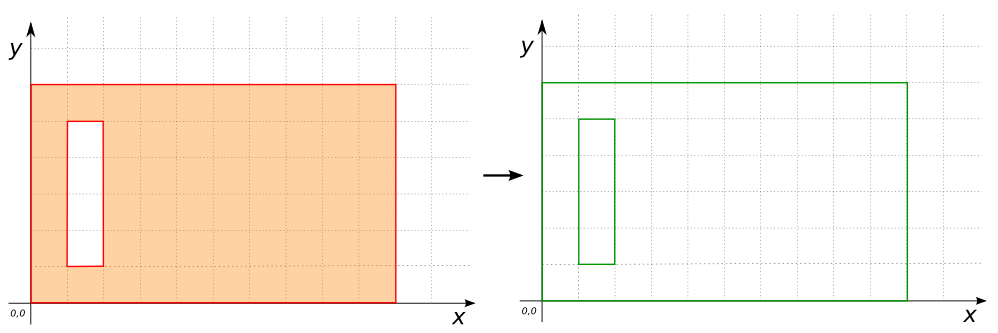
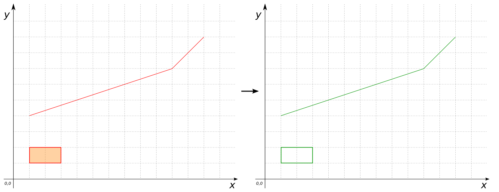

### Signatures


MULTILINESTRING ST_ToMultiLine(GEOMETRY geom);
MULTILINESTRING ST_ToMultiLine(GEOMETRYCOLLECTION geom);


### Description

Constructs a `MULTILINESTRING` from `geom`'s coordinates. Returns
`MULTILINESTRING EMPTY` for Geometries of dimension 0.

### Examples


SELECT ST_ToMultiLine('POLYGON((0 0, 10 0, 10 6, 0 6, 0 0),
                                (1 1, 2 1, 2 5, 1 5, 1 1))');
-- Answer: MULTILINESTRING((0 0, 10 0, 10 5, 0 5, 0 0),
--                          (1 1, 2 1, 2 4, 1 4, 1 1))



SELECT ST_ToMultiLine(
    'GEOMETRYCOLLECTION(
       LINESTRING(1 4 3, 10 7 9, 12 9 22),
       POLYGON((1 1 -1, 3 1 0, 3 2 1, 1 2 2, 1 1 -1)))');
-- Answer: MULTILINESTRING((1 4, 10 7, 12 9),
--                          (1 1, 3 1, 3 2, 1 2, 1 1))



SELECT ST_ToMultiLine('POINT(2 4)');
-- Answer: MULTILINESTRING EMPTY


##### Comparison with [`ST_ToMultiSegments`](../ST_ToMultiSegments)



##### See also

* [`ST_ToMultiSegments`](../ST_ToMultiSegments)
* <a href="https://github.com/orbisgis/h2gis/blob/master/h2spatial-ext/src/main/java/org/h2gis/h2spatialext/function/spatial/convert/ST_ToMultiLine.java" target="_blank">Source code</a>
