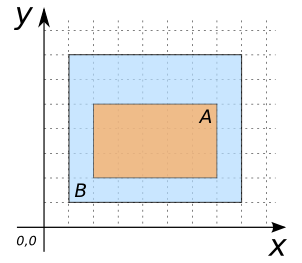
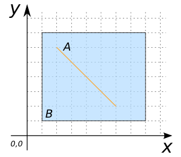
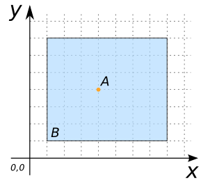
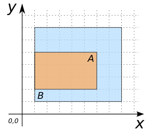
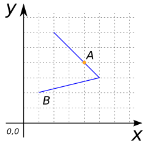

### Signatures


BOOLEAN ST_Within(GEOMETRY geomA, GEOMETRY geomB);


### Description

Returns true if `geomA` is within `geomB`.

Within means that every point of `geomA` is a point of `geomB`, and the
interiors of the two geometries have at least one point in common.

As a consequence, the following are equivalent:

* `ST_Within(geomA, geomB)` and `ST_Within(geomB, geomA)` are true.
* `ST_Equals(geomA, geomB)` is true.





### Examples

##### Cases where `ST_Within` is true


SELECT ST_Within(geomA, geomB) FROM input_table;
-- Answer:    TRUE


| geomA POLYGON                       | geomB POLYGON                       |
|-------------------------------------|-------------------------------------|
| POLYGON((2 2, 7 2, 7 5, 2 5, 2 2))  | POLYGON((1 1, 8 1, 8 7, 1 7, 1 1))  |

| geomA LINESTRING      | geomB POLYGON                       |
|-----------------------|-------------------------------------|
| LINESTRING(2 6, 6 2)  | POLYGON((1 1, 8 1, 8 7, 1 7, 1 1))  |

| geomA POINT | geomB POLYGON                       |
|-------------|-------------------------------------|
| POINT(4 4)  | POLYGON((1 1, 8 1, 8 7, 1 7, 1 1))  |

| geomA POLYGON                       | geomB POLYGON                       |
|-------------------------------------|-------------------------------------|
| POLYGON((1 2, 6 2, 6 5, 1 5, 1 2))  | POLYGON((1 1, 8 1, 8 7, 1 7, 1 1))  |

| geomA LINESTRING           | geomB POLYGON                       |
|----------------------------|-------------------------------------|
| LINESTRING(1 2, 1 6, 5 2)  | POLYGON((1 1, 8 1, 8 7, 1 7, 1 1))  |

| geomA LINESTRING      | geomB LINESTRING           |
|-----------------------|----------------------------|
| LINESTRING(3 5, 5 3)  | LINESTRING(2 1, 5 3, 2 6)  |

| geomA POINT | geomB LINESTRING           |
|-------------|----------------------------|
| POINT(4 4)  | LINESTRING(2 1, 5 3, 2 6)  |

##### Cases where `ST_Within` is false


SELECT ST_Within(geomA, geomB) FROM input_table;
-- Answer:    FALSE


| geomA POLYGON                       | geomB POLYGON                       |
|-------------------------------------|-------------------------------------|
| POLYGON((0 2, 5 2, 5 5, 0 5, 0 2))  | POLYGON((1 1, 8 1, 8 7, 1 7, 1 1))  |

| geomA LINESTRING      | geomB POLYGON                       |
|-----------------------|-------------------------------------|
| LINESTRING(2 6, 0 8)  | POLYGON((1 1, 8 1, 8 7, 1 7, 1 1))  |

| geomA POINT | geomB POLYGON                       |
|-------------|-------------------------------------|
| POINT(8 4)  | POLYGON((1 1, 8 1, 8 7, 1 7, 1 1))  |

| geomA POINT | geomB POLYGON                       |
|-------------|-------------------------------------|
| POINT(8 4)  | POLYGON((1 1, 7 1, 7 7, 1 7, 1 1))  |

##### See also

* [`ST_Contains`](../ST_Contains), [`ST_Overlaps`](../ST_Overlaps), [`ST_Touches`](../ST_Touches)
* <a href="https://github.com/orbisgis/h2gis/blob/v1.3.0/h2gis-functions/src/main/java/org/h2gis/functions/spatial/predicates/ST_Within.java" target="_blank">Source code</a>
