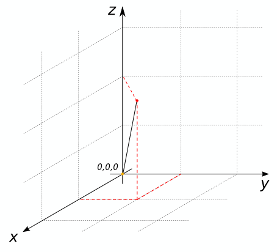

### Signature


INT ST_CoordDim(GEOMETRY geom)


### Description
Returns the dimension of the coordinates of `geom`.

### Examples


SELECT ST_CoordDim('POINT(1 2)');
-- Answer: 2

SELECT ST_CoordDim('LINESTRING(0 0 0, 1 1 2)');
-- Answer: 3



SELECT ST_CoordDim('LINESTRING(1 1 1, 2 1 2, 2 2 3, 1 2 4, 1 1 5)');
-- Answer: 3

SELECT ST_CoordDim('MULTIPOLYGON(((0 0, 1 1, 0 1, 0 0)))');
-- Answer: 2



##### See also

* [`ST_Dimension`](../ST_Dimension)
* <a href="https://github.com/orbisgis/h2gis/blob/master/h2gis-functions/src/main/java/org/h2gis/functions/spatial/properties/ST_CoordDim.java" target="_blank">Source code</a>
