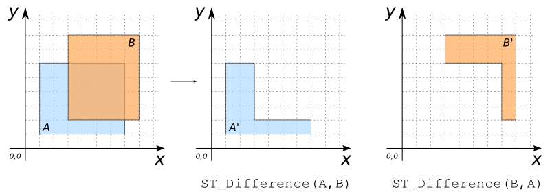

### Signatures


GEOMETRY ST_Difference(GEOMETRY geomA, GEOMETRY geomB)


### Description

Computes the difference between `geomA` and `geomB`.



### Examples

| geomA Polygon                      | geomB Polygon                      |
|------------------------------------|------------------------------------|
| POLYGON((1 1, 7 1, 7 6, 1 6, 1 1)) | POLYGON((3 2, 8 2, 8 8, 3 8, 3 2)) |


SELECT ST_Difference(geomA, geomB) FROM input_table;
-- Answer:    POLYGON((1 1, 7 1, 7 2, 3 2, 3 6, 1 6, 1 1))

SELECT ST_Difference(geomB, geomA) FROM input_table;
-- Answer:    POLYGON((7 2, 8 2, 8 8, 3 8, 3 6, 7 6, 7 2))


##### See also

* [`ST_SymDifference`](../ST_SymDifference)
* <a href="https://github.com/orbisgis/h2gis/blob/master/h2gis-functions/src/main/java/org/h2gis/functions/spatial/operators/ST_Difference.java" target="_blank">Source code</a>
