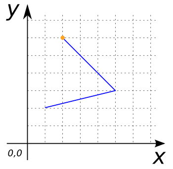

### Signature


POINT ST_EndPoint(GEOMETRY geom);


### Description

Returns the last coordinate of `geom` as a `POINT`, given that `geom` is a
`LINESTRING` or a `MULTILINESTRING` containing only one `LINESTRING`. Returns
`NULL` for all other Geometries.

<!-- This function does not seem to be SFS. Is it SQL-MM? -->

### Examples


SELECT ST_EndPoint('LINESTRING(1 2, 5 3, 2 6)');
-- Answer: POINT(2 6)



SELECT ST_EndPoint('MULTILINESTRING((1 1, 3 2, 3 1))');
-- Answer: POINT(3 1)

SELECT ST_EndPoint('MULTILINESTRING((1 1, 3 2, 3 1),
                                    (1 2, 5 3, 2 6))');
-- Answer: NULL


##### See also

* [`ST_StartPoint`](../ST_StartPoint), [`ST_PointN`](../ST_PointN)
* <a href="https://github.com/orbisgis/h2gis/blob/master/h2gis-functions/src/main/java/org/h2gis/functions/spatial/properties/ST_EndPoint.java" target="_blank">Source code</a>
