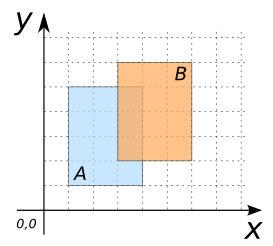
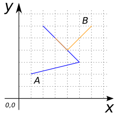
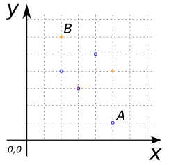
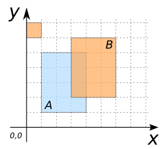
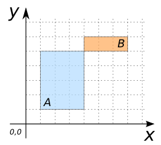
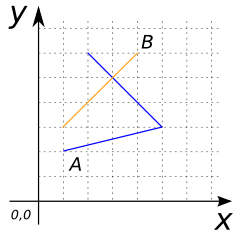

### Signatures


BOOLEAN ST_Overlaps(GEOMETRY geomA, GEOMETRY geomB);


### Description

Returns true if `geomA` overlaps `geomB`.

Overlaps means that the two geometries:

* have some but not all points in common,
* have the same dimension, and
* the intersection of their interiors has the same dimension as the
  geometries themselves.





### Examples

##### Cases where `ST_Overlaps` is true


SELECT ST_Overlaps(geomA, geomB) FROM input_table;
-- Answer:    TRUE


| geomA POLYGON                       | geomB POLYGON                       |
|-------------------------------------|-------------------------------------|
| POLYGON((1 1, 4 1, 4 5, 1 5, 1 1))  | POLYGON((3 2, 6 2, 6 6, 3 6, 3 2))  |

| geomA LINESTRING           | geomB LINESTRING           |
|----------------------------|----------------------------|
| LINESTRING(2 1, 5 3, 2 6)  | LINESTRING(3 5, 4 4, 6 7)  |

| geomA MULTIPOINT                        | geomB MULTIPOINT                 |
|-----------------------------------------|----------------------------------|
| MULTIPOINT((5 1), (3 3), (2 5), (4 5))  | MULTIPOINT((3 3), (5 4), (2 6))  |

| geomA POLYGON                       | geomB MULTIPOLYGON                                                      |
|-------------------------------------|-------------------------------------------------------------------------|
| POLYGON((1 1, 4 1, 4 5, 1 5, 1 1))  | MULTIPOLYGON(((3 2, 6 2, 6 6, 3 6, 3 2)), ((0 6, 1 6, 1 7, 0 7, 0 6)))  |

##### Cases where `ST_Overlaps` is false


SELECT ST_Overlaps(geomA, geomB) FROM input_table;
-- Answer:    FALSE


| geomA POLYGON                       | geomB POLYGON                       |
|-------------------------------------|-------------------------------------|
| POLYGON((1 1, 4 1, 4 5, 1 5, 1 1))  | POLYGON((4 5, 7 5, 7 6, 4 6, 4 5))  |

| geomA LINESTRING           | geomB LINESTRING      |
|----------------------------|-----------------------|
| LINESTRING(2 1, 5 3, 2 6)  | LINESTRING(1 3, 4 6)  |

##### See also

* [`ST_Intersects`](../ST_Intersects), [`ST_Contains`](../ST_Contains)
* <a href="https://github.com/orbisgis/h2gis/blob/master/h2gis-functions/src/main/java/org/h2gis/functions/spatial/predicates/ST_Overlaps.java" target="_blank">Source code</a>
