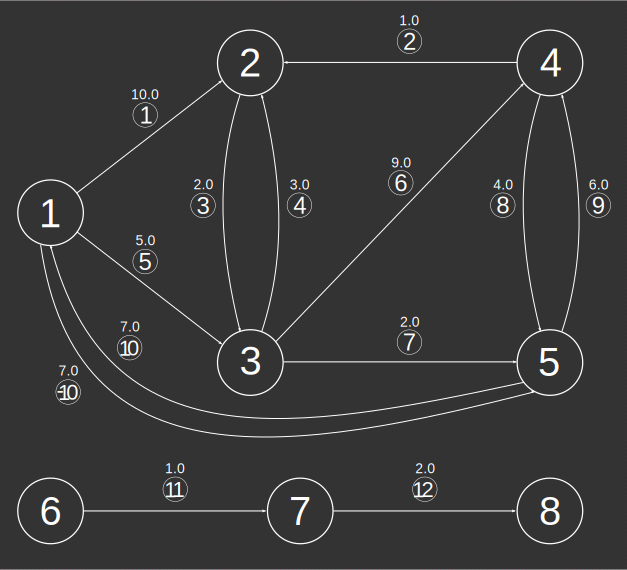
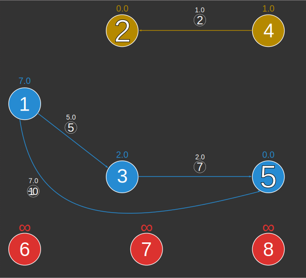
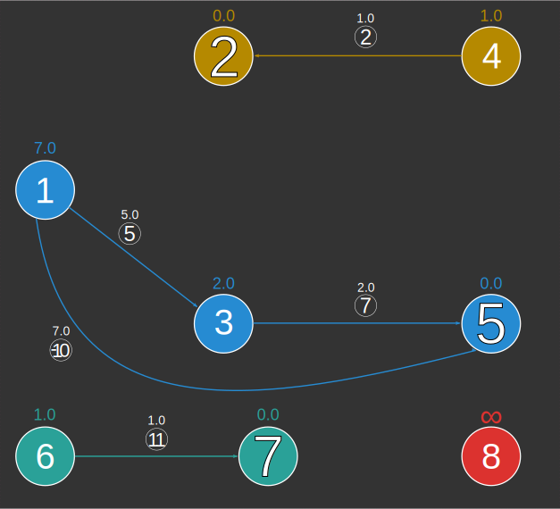

# ST_Accessibility

## Signatures

```sql
-- Return type:
--     TABLE[SOURCE, CLOSEST_DEST, DISTANCE]
ST_Accessibility('INPUT_EDGES', 'o[ - eo]'[, 'w'], 'ds');
ST_Accessibility('INPUT_EDGES', 'o[ - eo]'[, 'w'], 'dt');
```

## Description

Calculates, for each vertex in a graph, the closest destination
among several possible destinations as well as the distance to this
destination.

<div class="note">
  <h5>Using this function will be faster than doing an equivalent
  calculation using <a
  href="../ST_ShortestPathLength"><code>ST_ShortestPathLength</code></a>.</h5>
  <p><code>ST_Accessibility</code> is implemented as follows: The
  graph is reversed, and Dijkstra's algorithm is run from each
  destination vertex. This is much more efficient than running
  Dijkstra's algorithm from each vertex to each destination and
  taking the minimum distance.</p>
</div>

### Input parameters

| Variable      | Meaning                                                                                                                                                                                                                             |
|---------------|-------------------------------------------------------------------------------------------------------------------------------------------------------------------------------------------------------------------------------------|
| `INPUT_EDGES` | Table containing integer columns `EDGE_ID`, `START_NODE` and `END_NODE`;<br> and optionally a weight column `w` (if the graph is weighted)<br> and/or an edge orientation column `eo` <br> (required if global orientation is not `undirected`) |
| `o`           | Global orientation string: `directed`, `reversed` or `undirected`                                                                                                                                                                   |
| `eo`          | Edge orientation column name indicating individual edge orientations:<br> `1` (directed), `-1` (reversed) or `0` (undirected);<br> required if global orientation is `directed` or `reversed`                                               |
| `w`           | Edge weights column name                                                                                                                                                                                                            |
| `ds`          | Comma-separated destination string: `'dest1, dest2, ...'`                                                                                                                                                                           |
| `dt`          | Destination table name; must contain column `DESTINATION` <br>containing integer vertex ids                                                                                                                                             |

## Examples

We will do graph analysis on the directed weighted graph examined in the ST_ShortestPath examples, illustrated below
```sql
SELECT * FROM EDGES_EO_W;
-- | EDGE_ID | START_NODE | END_NODE | WEIGHT | EDGE_ORIENTATION |
-- |---------|------------|----------|--------|------------------|
-- |       1 |          1 |        2 |   10.0 |                1 |
-- |       2 |          2 |        4 |    1.0 |               -1 |
-- |       3 |          2 |        3 |    2.0 |                1 |
-- |       4 |          3 |        2 |    3.0 |                1 |
-- |       5 |          1 |        3 |    5.0 |                1 |
-- |       6 |          3 |        4 |    9.0 |                1 |
-- |       7 |          3 |        5 |    2.0 |                1 |
-- |       8 |          4 |        5 |    4.0 |                1 |
-- |       9 |          5 |        4 |    6.0 |                1 |
-- |      10 |          5 |        1 |    7.0 |                0 |
-- |      11 |          6 |        7 |    1.0 |                1 |
-- |      12 |          7 |        8 |    2.0 |                1 |
```



### Destination string

```sql
SELECT * FROM ST_Accessibility('EDGES_EO_W',
    'directed - EDGE_ORIENTATION', 'WEIGHT', '2, 5');
-- | SOURCE | CLOSEST_DEST | DISTANCE |
-- |--------|--------------|----------|
-- |      1 |            5 |      7.0 |
-- |      2 |            2 |      0.0 |
-- |      4 |            2 |      1.0 |
-- |      3 |            5 |      2.0 |
-- |      5 |            5 |      0.0 |
-- |      6 |           -1 | Infinity |
-- |      7 |           -1 | Infinity |
-- |      8 |           -1 | Infinity |
```



```sql
SELECT * FROM ST_Accessibility('EDGES_EO_W',
    'directed - EDGE_ORIENTATION', 'WEIGHT', '2, 5, 7');
-- | SOURCE | CLOSEST_DEST | DISTANCE |
-- |--------|--------------|----------|
-- |      1 |            5 |      7.0 |
-- |      2 |            2 |      0.0 |
-- |      4 |            2 |      1.0 |
-- |      3 |            5 |      2.0 |
-- |      5 |            5 |      0.0 |
-- |      6 |            7 |      1.0 |
-- |      7 |            7 |      0.0 |
-- |      8 |           -1 | Infinity |
```



### Destination table

Here we get the same results as before, but we do it using a destination table
```sql
CREATE TABLE DESTS(DESTINATION INT);
INSERT INTO DESTS VALUES (2), (5), (7);
SELECT * FROM ST_ACCESSIBILITY('EDGES_EO_W',
    'directed - EDGE_ORIENTATION', 'WEIGHT', 'DESTS');
-- | SOURCE | CLOSEST_DEST | DISTANCE |
-- |--------|--------------|----------|
-- |      1 |            5 |      7.0 |
-- |      2 |            2 |      0.0 |
-- |      4 |            2 |      1.0 |
-- |      3 |            5 |      2.0 |
-- |      5 |            5 |      0.0 |
-- |      6 |            7 |      1.0 |
-- |      7 |            7 |      0.0 |
-- |      8 |           -1 | Infinity |
```

### Exercises

1. Use [`ST_ShortestPathLength`](../ST_ShortestPathLength) to verify
   the results of `ST_Accessibility`.
2. Find an equivalence between
   [`ST_ShortestPathLength`](../ST_ShortestPathLength) called on one
   source and `ST_Accessibility` called on one destination. *Hint*:
   Think about reversing the graph.

## See also

* [`ST_ShortestPathLength`](../ST_ShortestPathLength)
* <a href="https://github.com/orbisgis/h2gis/blob/master/h2gis-network/src/main/java/org/h2gis/network/functions/ST_Accessibility.java" target="_blank">Source code</a>
* JNA <a
href="https://github.com/irstv/Java-Network-Analyzer/blob/master/src/main/java/org/javanetworkanalyzer/analyzers/AccessibilityAnalyzer.java"
target="_blank">AccessibilityAnalyzer</a>, <a
href="https://github.com/irstv/Java-Network-Analyzer/blob/3f68e220c6c060f0182435169c58956e2904eccd/src/main/java/org/javanetworkanalyzer/alg/DijkstraForAccessibility.java"
target="_blank">DijkstraForAccessibility</a>
