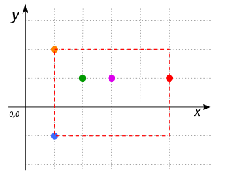

# ST_AsOverpassBbox

## Signature

```sql
VARCHAR ST_AsOverpassBbox(GEOMETRY geom);
```

## Description

Return a string representation of the envelope of `geom`, conform to the [Overpass API](https://wiki.openstreetmap.org/wiki/Overpass_API) format : South, West, North, East &rarr; Y<sub>Min</sub>, X<sub>Min</sub>, Y<sub>Max</sub>, X<sub>Max</sub>.

## Examples

### With a `POINT` 

```sql
SELECT ST_AsOverpassBbox('POINT(1 2)');
-- Answer: 2.0,1.0,2.0,1.0
```
### With a `LINESTRING`

```sql
SELECT ST_AsOverpassBbox('LINESTRING(1 1, 5 5)');
-- Answer: 1.0,1.0,5.0,5.0
```

### With a `LINESTRING` parallel to the x-axis

```sql
SELECT ST_AsOverpassBbox('LINESTRING(1 1, 5 1, 9 1)');
-- Answer: 1.0,1.0,1.0,9.0
```

### With a `MULTIPOINT`

```sql
SELECT ST_AsOverpassBbox('MULTIPOINT(1 2, 3 1, 2 1, 5 1, 1 -1)');
-- Answer: -1.0,1.0,2.0,5.0
```

{align=center}

### With a `GEOMETRYCOLLECTION`

```sql
SELECT ST_AsOverpassBbox('GEOMETRYCOLLECTION(
                               MULTIPOINT(1 2, 2 1, 1 -1),
                               LINESTRING(3 -1, 5 1),
                               POLYGON((2 2, 4 3, 3 1, 2 2)))');
-- Answer: -1.0,1.0,3.0,5.0
```
{align=center}

### With SRID in the query

```sql
select ST_AsOverpassBbox(ST_Expand('SRID=4326;POINT(-2.781140 47.643182)'::GEOMETRY, 10))

-- Answer: 37.643182,-12.78114,57.643182,7.218859999999999
```

## See also

 [`OSMRead`](../OSMRead), [`ST_OSMMapLink`](../ST_OSMMapLink), [`ST_OSMDownloader`](../ST_OSMDownloader), [`ST_OverpassDownloader`](../ST_OverpassDownloader)
* <a href="https://github.com/orbisgis/h2gis/blob/master/h2gis-functions/src/main/java/org/h2gis/functions/io/overpass/ST_AsOverpassBbox.java" target="_blank">Source code</a>
