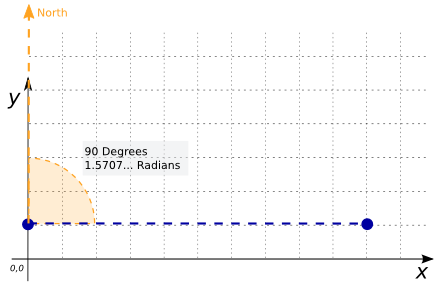

# ST_Azimuth

## Signature

```sql
DOUBLE ST_Azimuth(GEOMETRY pointA, GEOMETRY pointB);
```

## Description

Returns the [azimuth][wiki] in radians of the segment from `pointA` to
`pointB` clockwise from the North (0, 1).
Returns `NULL` if `pointA` and `pointB` are not `POINT` Geometries
or are coincident.

## Examples

```sql
SELECT ST_Azimuth('LINESTRING(0 0, 5 5)', 'POINT(10 0)');
-- Answer: NULL

SELECT DEGREES(ST_Azimuth('POINT(0 1)', 'POINT(10 1)'));
-- Answer: 90.0

SELECT ST_Azimuth('POINT(0 1)', 'POINT(10 1)');
-- Answer: 1.5707963267948966
```



## See also

* <a href="https://github.com/orbisgis/h2gis/blob/master/h2gis-functions/src/main/java/org/h2gis/functions/spatial/trigonometry/ST_Azimuth.java" target="_blank">Source code</a>

[wiki]: http://en.wikipedia.org/wiki/Azimuth
