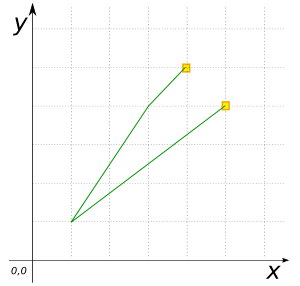
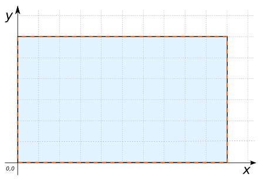
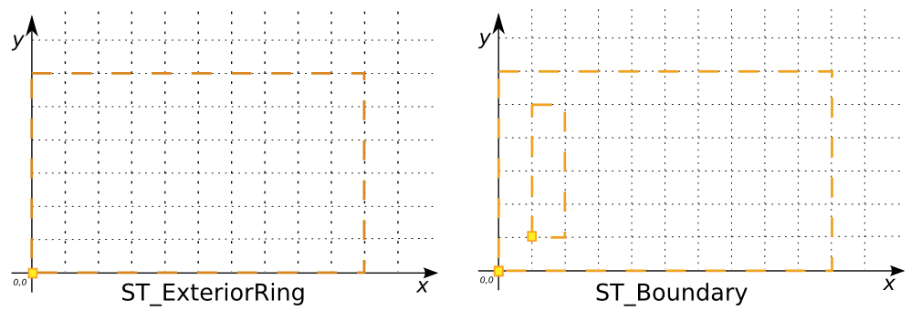

# ST_Boundary

## Signatures

```sql
GEOMETRY ST_Boundary(GEOMETRY geom);
GEOMETRY ST_Boundary(GEOMETRY geom, INT srid);
```

## Description

Returns the boundary of `geom`, optionally setting its SRID to `srid`.
The boundary of a Geometry is a set of Geometries of the next lower
dimension.

```{include} type-warning_geometrycollection.md
```

```{include} sfs-1-2-1.md
```

## Examples

```sql
SELECT ST_Boundary('LINESTRING(4 6, 1 1, 5 5)');
-- Answer: MULTIPOINT((4 6), (5 5))
```

{align=center}

```sql
SELECT ST_Boundary('POLYGON((0 0, 10 0, 10 10, 0 10, 0 0))', 2154);
-- Answer: LINEARRING(0 0, 10 0, 10 10, 0 10, 0 0)
```

{align=center}

```sql
-- This polygon has a hole.
SELECT ST_Boundary('POLYGON((5 4, 5 1, 2 1, 2 4, 4 5, 5 4),
                    (3 2, 3 3, 4 3, 4 2, 3 2))');
-- Answer: MULTILINESTRING((5 4, 5 1, 2 1, 2 4, 4 5, 5 4),
--                          (3 2, 3 3, 4 3, 4 2, 3 2))

-- A point has no boundary.
SELECT ST_Boundary('POINT(2 2)');
-- Answer: GEOMETRYCOLLECTION EMPTY
```

### Comparison with [`ST_ExteriorRing`](../ST_ExteriorRing)

```sql
SELECT ST_ExteriorRing('POLYGON((0 0, 10 0, 10 6, 0 6, 0 0),
                                (1 1, 2 1, 2 5, 1 5, 1 1))') ER,
       ST_Boundary('POLYGON((0 0, 10 0, 10 6, 0 6, 0 0),
                             (1 1, 2 1, 2 5, 1 5, 1 1))') BDRY;
```
Answer:
|              ER             |            BDRY              |
|-----------------------------|------------------------------|
| LINEARRING(0 0, 10 0, 10 6, 0 6, 0 0) | MULTILINESTRING(<br>(0 0, 10 0, 10 6, 0 6, 0 0),<br> (1 1, 2 1, 2 5, 1 5, 1 1))   |

{align=center}

## See also

* [`ST_ExteriorRing`](../ST_ExteriorRing)
* <a href="https://github.com/orbisgis/h2gis/blob/master/h2gis-functions/src/main/java/org/h2gis/functions/spatial/properties/ST_Boundary.java" target="_blank">Source code</a>
