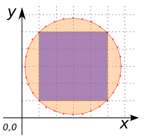
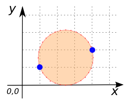
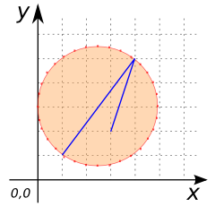

# ST_BoundingCircle

## Signature

```sql
GEOMETRY ST_BoundingCircle(GEOMETRY geom);
```

## Description

Returns the minimum bounding circle of `geom`.
Each circle contains 32 line segments.

## Examples

```sql
SELECT ST_BoundingCircle('POLYGON((1 1, 1 4, 4 4, 4 1, 1 1))');
```
-- Answer: POLYGON((4.621320343559642 2.5, 4.580559767983221 2.0861509310755855, 4.459844447314564 1.6882058497807044, 4.263813403629038 1.321457562419347, 4 1.0000000000000002, 3.6785424375806532 0.7361865963709622, 3.3117941502192956 0.5401555526854354, 2.9138490689244145 0.4194402320167789, 2.5 0.3786796564403576, 2.0861509310755855 0.4194402320167789, 1.6882058497807046 0.5401555526854354, 1.3214575624193474 0.736186596370962, 1.0000000000000002 1, 0.736186596370962 1.321457562419347, 0.5401555526854351 1.6882058497807053, 0.4194402320167789 2.086150931075587, 0.3786796564403576 2.5000000000000018, 0.4194402320167794 2.9138490689244163, 0.5401555526854365 3.311794150219298, 0.7361865963709637 3.6785424375806555, 1.0000000000000027 4.000000000000002, 1.32145756241935 4.26381340362904, 1.6882058497807084 4.459844447314566, 2.0861509310755904 4.580559767983222, 2.5000000000000053 4.621320343559642, 2.91384906892442 4.580559767983219, 3.311794150219301 4.459844447314563, 3.678542437580659 4.263813403629034, 4.000000000000005 3.9999999999999947, 4.263813403629042 3.678542437580647, 4.459844447314568 3.311794150219288, 4.580559767983223 2.913849068924406, 4.621320343559642 2.5))


{align=center}

```sql
SELECT ST_BoundingCircle('MULTIPOINT((1 1), (4 2))');
```
-- Answer: POLYGON((4.08113883008419 1.5, 4.050757690820558 1.1915351164866712, 3.9607818031736244 0.8949243654576597, 3.814668890046601 0.6215663317337855, 3.618033988749895 0.3819660112501051, 3.3784336682662146 0.1853311099533987, 3.1050756345423403 0.0392181968263758, 2.808464883513329 -0.0507576908205578, 2.5 -0.0811388300841898, 2.191535116486671 -0.0507576908205578, 1.8949243654576597 0.0392181968263758, 1.6215663317337858 0.1853311099533985, 1.381966011250105 0.3819660112501051, 1.1853311099533985 0.6215663317337855, 1.0392181968263758 0.8949243654576603, 0.949242309179442 1.1915351164866719, 0.9188611699158102 1.500000000000001, 0.9492423091794426 1.8084648835133303, 1.0392181968263767 2.105075634542342, 1.1853311099534 2.3784336682662164, 1.3819660112501069 2.6180339887498967, 1.6215663317337878 2.814668890046603, 1.8949243654576629 2.9607818031736253, 2.1915351164866745 3.0507576908205585, 2.500000000000004 3.08113883008419, 2.808464883513333 3.050757690820557, 3.1050756345423443 2.9607818031736226, 3.3784336682662186 2.8146688900465984, 3.6180339887498985 2.6180339887498913, 3.8146688900466046 2.3784336682662097, 3.960781803173626 2.1050756345423345, 4.050757690820559 1.8084648835133228, 4.08113883008419 1.5))


{align=center}

```sql
SELECT ST_BoundingCircle('LINESTRING(1 1, 4 5, 3 2)');
```
-- Answer: POLYGON((5 3, 4.951963201008076 2.512274194959679, 4.809698831278217 2.0432914190872755, 4.578674030756363 1.6110744174509946, 4.267766952966369 1.2322330470336313, 3.888925582549006 0.9213259692436369, 3.4567085809127245 0.690301168721783, 2.987725805040321 0.5480367989919239, 2.5 0.5, 2.0122741949596796 0.5480367989919239, 1.5432914190872757 0.690301168721783, 1.111074417450995 0.9213259692436369, 0.7322330470336313 1.2322330470336311, 0.4213259692436369 1.6110744174509946, 0.190301168721783 2.0432914190872764, 0.0480367989919235 2.5122741949596805, 0 3.0000000000000018, 0.0480367989919244 3.487725805040323, 0.1903011687217844 3.956708580912727, 0.4213259692436386 4.3889255825490086, 0.7322330470336342 4.7677669529663715, 1.111074417450998 5.078674030756366, 1.5432914190872804 5.309698831278219, 2.012274194959685 5.451963201008077, 2.500000000000006 5.5, 2.987725805040327 5.451963201008075, 3.456708580912731 5.309698831278214, 3.888925582549012 5.078674030756359, 4.267766952966374 4.767766952966363, 4.578674030756368 4.388925582548998, 4.8096988312782205 3.9567085809127156, 4.951963201008078 3.487725805040311, 5 3))


{align=center}

## See also

* <a href="https://github.com/orbisgis/h2gis/blob/master/h2gis-functions/src/main/java/org/h2gis/functions/spatial/create/ST_BoundingCircle.java" target="_blank">Source code</a>
* JTS [MinimumBoundingCircle][jts]

[jts]: http://tsusiatsoftware.net/jts/javadoc/com/vividsolutions/jts/algorithm/MinimumBoundingCircle.html
