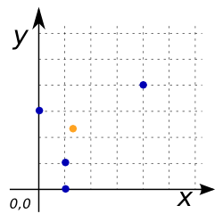

# ST_Centroid

## Signatures

```sql
POINT ST_Centroid(GEOMETRY geom);
POINT ST_Centroid(GEOMETRYCOLLECTION geom);
```

## Description

Returns the centroid of `geom` as a `POINT`.

<div class="note warning">
  <h5>Only the highest-dimension Geometries of a
  <code>GEOMETRYCOLLECTION</code> are considered.</h5>
  <p>The lower-dimension Geometries contribute zero weight to the centroid.</p>
</div>

```{include} sfs-1-2-1.md
```

## Examples

```sql
SELECT ST_Centroid('MULTIPOINT((4 4), (1 1), (1 0), (0 3)))');
-- Answer: POINT(1.25 2.25)
```

{align=center}

```sql
SELECT ST_Centroid('LINESTRING(2 1, 1 3, 5 2)');
-- Answer: POINT(2.472556942838389 2.3241856476127962)

SELECT ST_Centroid('MULTILINESTRING((1 5, 6 5), (5 1, 5 4))');
-- Answer: POINT(4.0625 4.0625)
```

{align=center}

```sql
SELECT ST_Centroid('POLYGON((1 5, 1 2, 6 2, 3 3, 3 4, 5 6, 1 5))');
-- Answer: POINT(2.5964912280701755 3.666666666666667)

SELECT ST_Centroid('MULTIPOLYGON(((0 2, 3 2, 3 6, 0 6, 0 2)),
                                 ((5 0, 7 0, 7 1, 5 1, 5 0)))');
-- Answer: POINT(2.142857142857143 3.5)
```

{align=center}

```sql
SELECT ST_Centroid('GEOMETRYCOLLECTION(
                      POLYGON((1 2, 4 2, 4 6, 1 6, 1 2)),
                      LINESTRING(2 6, 6 2),
                      MULTIPOINT((4 4), (1 1), (1 0), (0 3)))');
-- Answer: POINT(2.5 4)
```

{align=center}

### Comparison with [`ST_PointOnSurface`](../ST_PointOnSurface)

```sql
CREATE TABLE input(geom GEOMETRY);
INSERT INTO input VALUES (
    'POLYGON((0 0, 5 0, 5 1, 1 1, 1 4, 5 4, 5 5, 0 5, 0 0))');
SELECT ST_PointOnSurface(geom) POINT,
       ST_Centroid(geom) CENTROID FROM input;
```

Answer:
|      POINT      |            CENTROID            |
|-----------------|--------------------------------|
| POINT(0.5 2.5)  | POINT(2.0384615384615383 2.5)  |

{align=center}

## See also

* [`ST_PointOnSurface`](../ST_PointOnSurface)
* <a href="https://github.com/orbisgis/h2gis/blob/master/h2gis-functions/src/main/java/org/h2gis/functions/spatial/properties/ST_Centroid.java" target="_blank">Source code</a>
