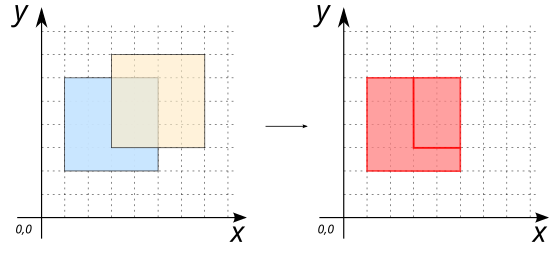
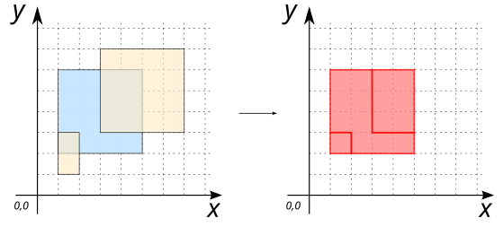
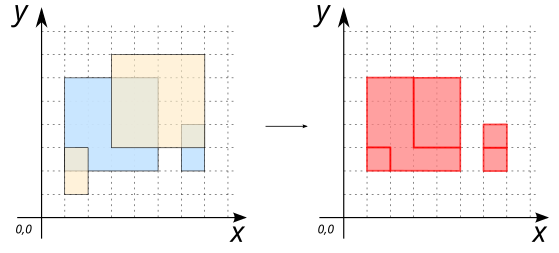
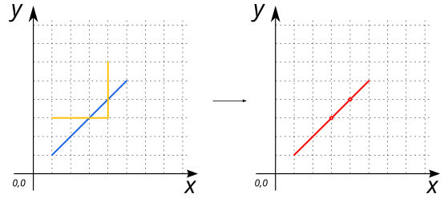
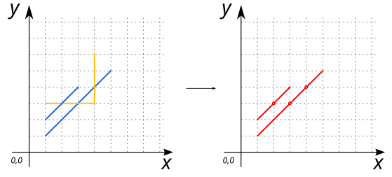
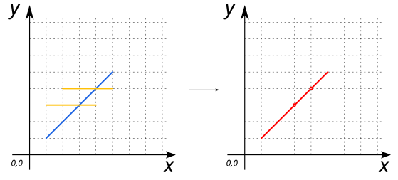
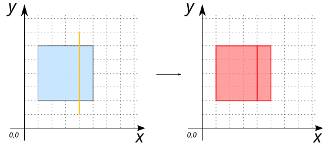
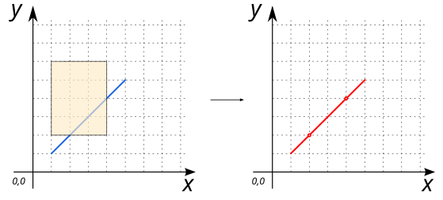
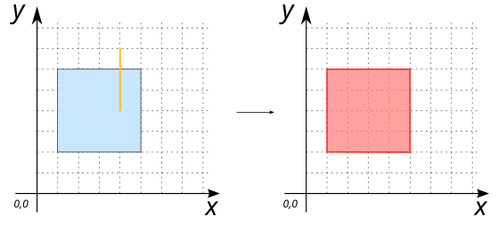
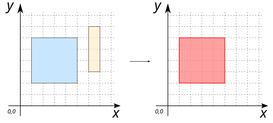

# ST_Clip

## Signatures

```sql
GEOMETRY ST_Clip(GEOMETRY geomToClip, GEOMETRY geomForClip);
```

## Description

Clip a geometry `geomToClip` with another a geometry `geomForClip`.

:::{warning}
`geomToClip` and `geomForClip` have to be `(MULTI)POLYGON` or `(MULTI)LINESTRING`
:::

## Examples

### `POLYGON` with `POLYGON`

```sql
SELECT ST_Clip('POLYGON((1 2, 5 2, 5 6, 1 6, 1 2))', 
               'POLYGON((3 3, 7 3, 7 7, 3 7, 3 3))');

-- Answer: MULTIPOLYGON (((1 2, 1 6, 3 6, 3 3, 5 3, 5 2, 1 2)), 
--                       ((3 6, 5 6, 5 3, 3 3, 3 6)))
```

{align=center}


### `MULTIPOLYGON` with `POLYGON`

```sql
SELECT ST_Clip('MULTIPOLYGON(((1 2, 5 2, 5 6, 1 6, 1 2)), 
                             ((6 2, 7 2, 7 4, 6 4, 6 2)))', 
               'POLYGON((3 3, 7 3, 7 7, 3 7, 3 3))');

-- Answer: MULTIPOLYGON (((5 3, 5 2, 1 2, 1 6, 3 6, 3 3, 5 3)), 
--                       ((3 3, 3 6, 5 6, 5 3, 3 3)), 
--                       ((6 2, 6 3, 7 3, 7 2, 6 2)), 
--                       ((6 3, 6 4, 7 4, 7 3, 6 3)))
```

{align=center}

### `POLYGON` with `MULTIPOLYGON`

```sql
SELECT ST_Clip('POLYGON((1 2, 5 2, 5 6, 1 6, 1 2))', 
               'MULTIPOLYGON(((3 3, 7 3, 7 7, 3 7, 3 3)), 
                             ((1 1, 2 1, 2 3, 1 3, 1 1)))');

-- Answer: MULTIPOLYGON (((1 3, 2 3, 2 2, 1 2, 1 3)), 
--                       ((5 3, 5 2, 2 2, 2 3, 1 3, 1 6, 3 6, 3 3, 5 3)), 
--                       ((3 6, 5 6, 5 3, 3 3, 3 6)))
```

{align=center}

### `MULTIPOLYGON` with `MULTIPOLYGON`

```sql
SELECT ST_Clip('MULTIPOLYGON(((1 2, 5 2, 5 6, 1 6, 1 2)), 
                             ((6 2, 7 2, 7 4, 6 4, 6 2)))', 
               'MULTIPOLYGON(((3 3, 7 3, 7 7, 3 7, 3 3)), 
                             ((1 1, 2 1, 2 3, 1 3, 1 1)))');

-- Answer: MULTIPOLYGON (((2 2, 1 2, 1 3, 2 3, 2 2)), 
--                       ((2 2, 2 3, 1 3, 1 6, 3 6, 3 3, 5 3, 5 2, 2 2)), 
--                       ((5 3, 3 3, 3 6, 5 6, 5 3)), 
--                       ((7 3, 7 2, 6 2, 6 3, 7 3)), 
--                       ((6 3, 6 4, 7 4, 7 3, 6 3)))
```

{align=center}

### `LINESTRING` with `LINESTRING`

```sql
SELECT ST_Clip('LINESTRING(1 1, 5 5)', 
               'LINESTRING(1 3, 4 3, 4 6)');

-- Answer: MULTILINESTRING ((1 1, 3 3), (3 3, 4 4), (4 4, 5 5))
```

{align=center}

### `MULTILINESTRING` with `LINESTRING`

```sql
SELECT ST_Clip('MULTILINESTRING((1 1, 5 5), (1 2, 3 4))', 
               'LINESTRING(1 3, 4 3, 4 6)');

-- Answer: MULTILINESTRING ((1 1, 3 3), (3 3, 4 4), (4 4, 5 5), 
--                          (1 2, 2 3), (2 3, 3 4))
```

{align=center}

### `LINESTRING` with `MULTILINESTRING`

```sql
SELECT ST_Clip('LINESTRING(1 1, 5 5)', 
               'MULTILINESTRING((1 3, 4 3), (2 4, 5 4))');

-- Answer: MULTILINESTRING ((1 1, 3 3), (3 3, 4 4), (4 4, 5 5))
```

{align=center}

### `POLYGON` with `LINESTRING`

```sql
SELECT ST_Clip('POLYGON((1 2, 5 2, 5 6, 1 6, 1 2))', 
               'LINESTRING(4 1, 4 7)');

-- Answer: MULTIPOLYGON (((4 6, 4 2, 1 2, 1 6, 4 6)), 
--                       ((4 2, 4 6, 5 6, 5 2, 4 2)))
```

{align=center}

### `LINESTRING` with `POLYGON` 

```sql
SELECT ST_Clip('LINESTRING(1 1, 5 5)', 
               'POLYGON((1 2, 4 2, 4 6, 1 6, 1 2))');

-- Answer: MULTILINESTRING ((1 1, 2 2), (2 2, 4 4), (4 4, 5 5))
```

{align=center}


### Cases where the result is the same as `geomToClip`

```sql
SELECT ST_Clip('POLYGON((1 2, 5 2, 5 6, 1 6, 1 2))', 
               'LINESTRING(4 4, 4 7)');

-- Answer: POLYGON ((1 2, 1 6, 4 6, 5 6, 5 2, 1 2))
```

{align=center}

```sql
SELECT ST_Clip('POLYGON((1 2, 5 2, 5 6, 1 6, 1 2))', 
               'POLYGON((6 3, 7 3, 7 7, 6 7, 6 3))');

-- Answer: POLYGON ((1 2, 1 6, 4 6, 5 6, 5 2, 1 2))
```

{align=center}


## See also

* [`ST_Split`](../ST_Split), [`ST_LineIntersector`](../ST_LineIntersector), [`ST_Intersection`](../ST_Intersection)
* <a href="https://github.com/orbisgis/h2gis/blob/master/h2gis-functions/src/main/java/org/h2gis/functions/spatial/others/ST_Clip.java" target="_blank">Source code</a>
