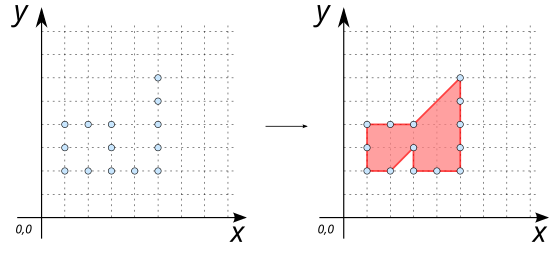
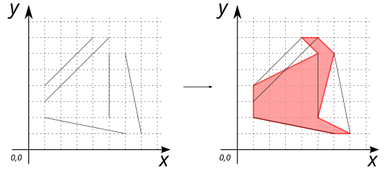
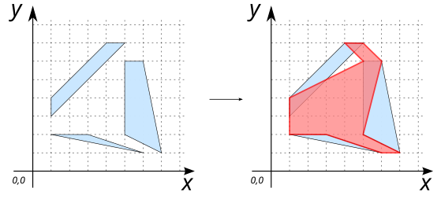
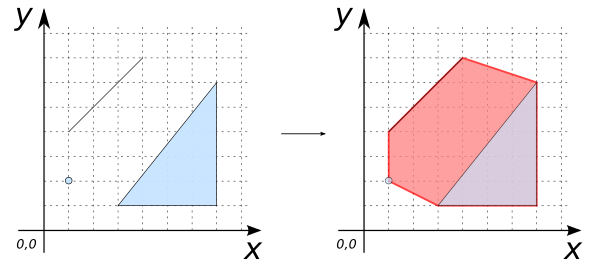
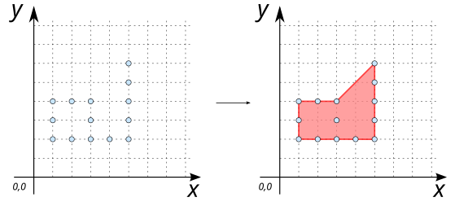
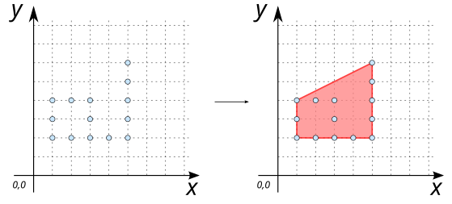
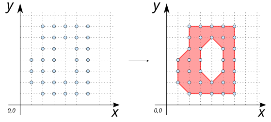
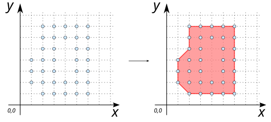

# ST_ConcaveHull

## Signature

```sql
GEOMETRY ST_ConvexHull(GEOMETRY geom)
GEOMETRY ST_ConvexHull(GEOMETRY geom, double ratio)
GEOMETRY ST_ConvexHull(GEOMETRY geom, boolean allow_holes)
GEOMETRY ST_ConvexHull(GEOMETRY geom, double ratio, boolean allow_holes)
```

## Description

Computes the smallest concave `POLYGON` that contains all the points of the input `geom`.

`geom` can be a set of `POINT`s, `LINESTRING`s, `POLYGON`s or a `GEOMETRYCOLLECTION`.

Set `allow_holes` to `TRUE` to allow hole in the concave geometry.

Set a `ratio` value between `0` and `1` to increase the hull concaveness. Values between `0.3` and `0.1` produce reasonable results. 

:::{warning}
Whether `geom` is `(MULTI)POINT`, `(MULTI)LINESTRING` or `(MULTI)POLYGON`, the resulting hull will **ONLY** enclose the input vertices of `geom`.
:::


```{include} sfs-1-2-1.md
```

## Examples

### With `MULTIPOINT`'s

```sql
SELECT ST_ConcaveHull('MULTIPOINT((1 2), (2 2), (3 2), (4 2), (5 2), (1 3), (3 3), 
                                  (5 3), (1 4), (2 4), (3 4), (5 4), (5 5), (5 6))');

-- Answer: POLYGON ((1 3, 1 4, 2 4, 3 4, 5 6, 5 5, 5 4, 5 3, 5 2, 4 2, 3 2, 3 3, 2 2, 1 2, 1 3))
```

{align=center}


### With `LINESTRING`'s

```sql
SELECT ST_ConcaveHull('MULTILINESTRING((1 2, 6 1),(1 3, 5 7), (1 4, 4 7), 
                                       (5 2, 5 6), (7 1, 6 6))');

-- Answer: POLYGON ((1 3, 1 4, 5 6, 4 7, 5 7, 6 6, 5 2, 7 1, 6 1, 1 2, 1 3))
```

{align=center}


### With `POLYGON`'s

```sql
SELECT ST_ConcaveHull('MULTIPOLYGON(((1 3, 5 7, 4 7, 1 4, 1 3)), 
                                    ((5 2, 5 6, 6 6, 7 1, 5 2)), 
                                    ((1 2, 6 1, 3 2, 1 2)))');

-- Answer: POLYGON ((1 3, 1 4, 5 6, 4 7, 5 7, 6 6, 5 2, 7 1, 6 1, 3 2, 1 2, 1 3))
```

{align=center}

### With `GEOMETRYCOLLECTION`

```sql
SELECT ST_ConcaveHull('GEOMETRYCOLLECTION(
                        POINT(1 2),
                        LINESTRING(1 4, 4 7),
                        POLYGON((3 1, 7 1, 7 6, 3 1)))');

-- Answer: POLYGON((3 1, 7 1, 7 6, 4 7, 1 4, 1 2, 3 1))
```

{align=center}

### With `ratio`

```sql
SELECT ST_ConcaveHull('MULTIPOINT((1 2), (2 2), (3 2), (4 2), (5 2), (1 3), (3 3), 
                                  (5 3), (1 4), (2 4), (3 4), (5 4), (5 5), (5 6))', 0.0);

-- Answer: POLYGON ((1 3, 1 4, 2 4, 3 4, 5 6, 5 5, 5 4, 5 3, 5 2, 4 2, 3 2, 3 3, 2 2, 1 2, 1 3))
```

{align=center}

```sql
SELECT ST_ConcaveHull('MULTIPOINT((1 2), (2 2), (3 2), (4 2), (5 2), (1 3), (3 3), 
                                  (5 3), (1 4), (2 4), (3 4), (5 4), (5 5), (5 6))', 0.5);

-- Answer: POLYGON ((1 3, 1 4, 2 4, 3 4, 5 6, 5 5, 5 4, 5 3, 5 2, 4 2, 3 2, 2 2, 1 2, 1 3))
```
{align=center}

```sql
SELECT ST_ConcaveHull('MULTIPOINT((1 2), (2 2), (3 2), (4 2), (5 2), (1 3), (3 3), 
                                  (5 3), (1 4), (2 4), (3 4), (5 4), (5 5), (5 6))', 1.0);

-- Answer: POLYGON ((1 3, 1 4, 5 6, 5 5, 5 4, 5 3, 5 2, 4 2, 3 2, 2 2, 1 2, 1 3))
```
{align=center}


### With `ratio` and `allow_holes`

```sql
SELECT ST_ConcaveHull('MULTIPOINT ((1 2), (1 3), (1 4), (2 1), (2 2), (2 3), (2 4), 
                                   (2 5), (2 6), (2 7), (3 1), (3 2), (3 3), (3 4), 
                                   (3 5), (3 6), (3 7), (4 1), (4 2), (4 6), (4 7), 
                                   (5 1), (5 2), (5 3), (5 4), (5 5), (5 6), (5 7), 
                                   (6 1), (6 2), (6 3), (6 4), (6 5), (6 6), (6 7))', 
                                   0.2, TRUE);

-- Answer: POLYGON ((2 7, 3 7, 4 7, 5 7, 6 7, 6 6, 6 5, 6 4, 6 3, 6 2, 6 1, 5 1, 
--                   4 1, 3 1, 2 1, 1 2, 1 3, 1 4, 2 5, 2 6, 2 7), 
--                  (3 5, 3 4, 3 3, 4 2, 5 3, 5 4, 5 5, 4 6, 3 5))
```

{align=center}

```sql
SELECT ST_ConcaveHull('MULTIPOINT ((1 2), (1 3), (1 4), (2 1), (2 2), (2 3), (2 4), 
                                   (2 5), (2 6), (2 7), (3 1), (3 2), (3 3), (3 4), 
                                   (3 5), (3 6), (3 7), (4 1), (4 2), (4 6), (4 7), 
                                   (5 1), (5 2), (5 3), (5 4), (5 5), (5 6), (5 7), 
                                   (6 1), (6 2), (6 3), (6 4), (6 5), (6 6), (6 7))', 
                                   0.2, FALSE);

-- Answer: POLYGON ((2 6, 2 7, 3 7, 4 7, 5 7, 6 7, 6 6, 6 5, 6 4, 6 3, 6 2, 6 1, 
--                   5 1, 4 1, 3 1, 2 1, 1 2, 1 3, 1 4, 2 5, 2 6))
```
{align=center}


## See also

* [`ST_ConvexHull`](../ST_ConvexHull)
* <a href="https://github.com/orbisgis/h2gis/blob/master/h2gis-functions/src/main/java/org/h2gis/functions/spatial/operators/ST_ConcaveHull.java" target="_blank">Source code</a>
