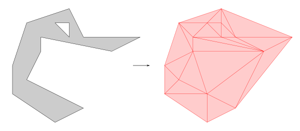
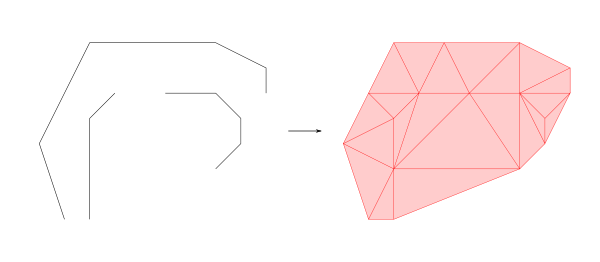
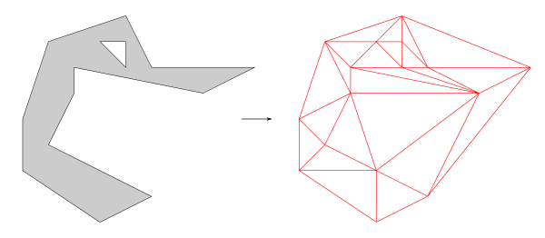

# ST_ConstrainedDelaunay

## Signature

```sql
GEOMETRY ST_ConstrainedDelaunay(GEOMETRY geom)
GEOMETRY ST_ConstrainedDelaunay(GEOMETRY geom, INTEGER flag)
GEOMETRY ST_ConstrainedDelaunay(GEOMETRY geom, INTEGER flag, DOUBLE minDistancePoint)
```

## Description

Returns a `MULTIPOLYGON` (or a `MULTILINESTRING`) that represent a Constrained Delaunay Triangulation from a geometry.

If `flag=0` *(default value)*, the output is a collection of `POLYGON`. 
If `flag=1`, a `MULTILINESTRING` is returned. 

The last argument can be set to improve the robustness of the triangulation by merging input points that are close together. The default value is 1e-12.

### Remark
If the input geometry does not contain any lines or polygons, a [Delaunay triangulation](../ST_Delaunay) will be computed.

## Examples

### 1rst signature, with `POLYGON`
```sql
SELECT ST_ConstrainedDelaunay('POLYGON ((4 8, 5 6, 9 6, 7 5, 2 6, 2 5, 
					 1 3, 3 2, 5 1, 3 0, 0 2, 0 4, 
					 1 7, 4 8), 
  			                (4 7, 3 7, 4 6, 4 7))');
-- Answer: 
MULTIPOLYGON (((0 4, 0 2, 1 3, 0 4)), ((0 4, 2 5, 1 3, 0 4)), ((0 4, 2 5, 1 7, 0 4)), ((2 5, 1 7, 2 6, 2 5)), 
	      ((0 2, 3 2, 3 0, 0 2)), ((0 2, 3 2, 1 3, 0 2)), ((1 3, 2 5, 3 2, 1 3)), ((7 5, 3 2, 5 1, 7 5)), 
	      ((2 6, 1 7, 3 7, 2 6)), ((2 6, 3 7, 4 6, 2 6)), ((4 6, 3 7, 4 7, 4 6)), ((4 7, 3 7, 4 8, 4 7)), 
	      ((3 7, 1 7, 4 8, 3 7)), ((3 0, 3 2, 5 1, 3 0)), ((7 5, 3 2, 2 5, 7 5)), ((4 6, 4 7, 5 6, 4 6)),
	      ((4 7, 4 8, 5 6, 4 7)), ((2 5, 7 5, 2 6, 2 5)), ((2 6, 4 6, 7 5, 2 6)), ((4 6, 5 6, 7 5, 4 6)),
	      ((5 1, 7 5, 9 6, 5 1)), ((7 5, 5 6, 9 6, 7 5)), ((5 6, 4 8, 9 6, 5 6)))
```

{align=center}

### 1rst signature, with `LINESTRING`
```sql
SELECT ST_ConstrainedDelaunay('MULTILINESTRING ((1 1, 0 4, 1 6, 2 8, 4 8, 7 8, 9 7, 9 6), 
  						(3 6, 2 5, 2 3, 2 1), 
  						(5 6, 7 6, 8 5, 8 4, 7 3))');
-- Answer: 
MULTIPOLYGON (((2 3, 1 1, 2 1, 2 3)), ((2 3, 1 1, 0 4, 2 3)), ((0 4, 2 5, 2 3, 0 4)), ((0 4, 2 5, 1 6, 0 4)),
	      ((1 6, 3 6, 2 5, 1 6)), ((2 3, 7 3, 2 1, 2 3)), ((2 3, 2 5, 3 6, 2 3)), ((1 6, 3 6, 2 8, 1 6)),
	      ((2 3, 5 6, 3 6, 2 3)), ((3 6, 2 8, 4 8, 3 6)), ((3 6, 5 6, 4 8, 3 6)), ((2 3, 7 3, 5 6, 2 3)),
	      ((7 3, 5 6, 7 6, 7 3)), ((5 6, 7 8, 7 6, 5 6)), ((5 6, 7 8, 4 8, 5 6)), ((7 3, 7 6, 8 4, 7 3)),
	      ((8 4, 7 6, 8 5, 8 4)), ((7 6, 9 6, 8 5, 7 6)), ((8 4, 8 5, 9 6, 8 4)), ((7 6, 9 7, 9 6, 7 6)),
	      ((7 6, 9 7, 7 8, 7 6)))
```

{align=center}


### 2nd signature, with `flag` parameter
```sql
SELECT ST_ConstrainedDelaunay('POLYGON ((4 8, 5 6, 9 6, 7 5, 2 6, 2 5, 
					 1 3, 3 2, 5 1, 3 0, 0 2, 0 4, 
					 1 7, 4 8), 
  			                (4 7, 3 7, 4 6, 4 7))'
			       , 1);
-- Answer: 
MULTILINESTRING ((0 2, 0 4), (0 2, 1 3), (0 4, 1 3), (0 4, 2 5), (0 4, 1 7), (1 3, 2 5), (1 7, 2 5), (2 5, 2 6),
		 (1 7, 2 6), (0 2, 3 0), (0 2, 3 2), (3 0, 3 2), (1 3, 3 2), (2 5, 3 2), (3 2, 7 5), (2 6, 3 7),
		 (1 7, 3 7), (2 6, 4 6), (3 7, 4 6), (4 6, 4 7), (3 7, 4 7), (4 7, 4 8), (3 7, 4 8), (1 7, 4 8),
		 (3 0, 5 1), (3 2, 5 1), (2 5, 7 5), (4 6, 5 6), (4 7, 5 6), (4 8, 5 6), (5 1, 7 5), (2 6, 7 5),
		 (4 6, 7 5), (5 6, 7 5), (5 1, 9 6), (7 5, 9 6), (5 6, 9 6), (4 8, 9 6))
```

{align=center}


## See also

* [`ST_Delaunay`](../ST_Delaunay), [`ST_Tesselate`](../ST_Tesselate)
* <a href="https://github.com/orbisgis/h2gis/blob/master/h2gis-functions/src/main/java/org/h2gis/functions/spatial/mesh/ST_ConstrainedDelaunay.java" target="_blank">Source code</a>
