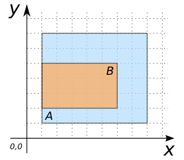
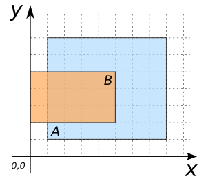
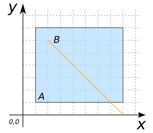

# ST_Contains

## Signature

```sql
BOOLEAN ST_Contains(GEOMETRY geomA, GEOMETRY geomB);
```

## Description

Returns true if `geomA` contains `geomB`.

```{include} sfs-1-2-1.md
```
```{include} spatial_indice_warning.md
```

## Examples

### Cases where `ST_Contains` is true

```sql
SELECT ST_Contains(geomA, geomB) FROM input_table;
-- Answer:    TRUE
```

| geomA POLYGON                       | geomB POLYGON                       |
|-------------------------------------|-------------------------------------|
| POLYGON((1 1, 8 1, 8 7, 1 7, 1 1))  | POLYGON((2 2, 7 2, 7 5, 2 5, 2 2))  |

{align=center}

| geomA POLYGON                       | geomB POLYGON                       |
|-------------------------------------|-------------------------------------|
| POLYGON((1 1, 8 1, 8 7, 1 7, 1 1))  | POLYGON((1 2, 6 2, 6 5, 1 5, 1 2))  |

{align=center}

| geomA POLYGON                       | geomB LINESTRING      |
|-------------------------------------|-----------------------|
| POLYGON((1 1, 8 1, 8 7, 1 7, 1 1))  | LINESTRING(2 6, 6 2)  |

{align=center}

| geomA POLYGON                       | geomB LINESTRING           |
|-------------------------------------|----------------------------|
| POLYGON((1 1, 8 1, 8 7, 1 7, 1 1))  | LINESTRING(1 2, 1 6, 5 2)  |

{align=center}

| geomA POLYGON                       | geomB POINT |
|-------------------------------------|-------------|
| POLYGON((1 1, 8 1, 8 7, 1 7, 1 1))  | POINT(4 4)  |

{align=center}

| geomA LINESTRING           | geomB LINESTRING      |
|----------------------------|-----------------------|
| LINESTRING(2 1, 5 3, 2 6)  | LINESTRING(3 5, 5 3)  |

{align=center}

| geomA LINESTRING           | geomB POINT |
|----------------------------|-------------|
| LINESTRING(2 1, 5 3, 2 6)  | POINT(4 4)  |

{align=center}

### Cases where `ST_Contains` is false

```sql
SELECT ST_Contains(geomA, geomB) FROM input_table;
-- Answer:    FALSE
```

| geomA POLYGON                       | geomB POLYGON                       |
|-------------------------------------|-------------------------------------|
| POLYGON((1 1, 8 1, 8 7, 1 7, 1 1))  | POLYGON((0 2, 5 2, 5 5, 0 5, 0 2))  |

{align=center}

| geomA POLYGON                       | geomB LINESTRING      |
|-------------------------------------|-----------------------|
| POLYGON((1 1, 8 1, 8 7, 1 7, 1 1))  | LINESTRING(2 6, 0 8)  |

{align=center}

| geomA POLYGON                       | geomB LINESTRING      |
|-------------------------------------|-----------------------|
| POLYGON((1 1, 8 1, 8 7, 1 7, 1 1))  | LINESTRING(1 2, 1 6)  |

{align=center}

| geomA POLYGON                       | geomB POINT |
|-------------------------------------|-------------|
| POLYGON((1 1, 8 1, 8 7, 1 7, 1 1))  | POINT(8 4)  |

{align=center}

| geomA POLYGON                       | geomB POINT |
|-------------------------------------|-------------|
| POLYGON((1 1, 7 1, 7 7, 1 7, 1 1))  | POINT(8 4)  |

{align=center}

## See also

* [`ST_Intersects`](../ST_Intersects), [`ST_Touches`](../ST_Touches), [`ST_Overlaps`](../ST_Overlaps)
* <a href="https://github.com/orbisgis/h2gis/blob/master/h2gis-functions/src/main/java/org/h2gis/functions/spatial/predicates/ST_Contains.java" target="_blank">Source code</a>
