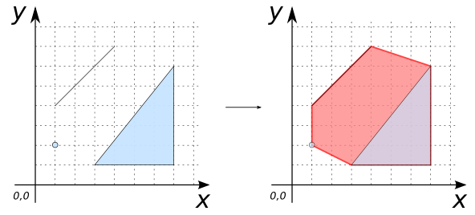

# ST_ConvexHull

## Signature

```sql
GEOMETRY ST_ConvexHull(GEOMETRY geom)
```

## Description

Computes the smallest convex `POLYGON` that contains all the points of `geom`.
`geom` can be a set of `POINT`s, `LINESTRING`s, `POLYGON`s or a
`GEOMETRYCOLLECTION`.

```{include} sfs-1-2-1.md
```

## Examples

```sql
SELECT ST_ConvexHull('GEOMETRYCOLLECTION(
                        POINT(1 2),
                        LINESTRING(1 4, 4 7),
                        POLYGON((3 1, 7 1, 7 6, 3 1)))');

-- Answer: POLYGON((3 1, 7 1, 7 6, 4 7, 1 4, 1 2, 3 1))
```



## See also

* <a href="https://github.com/orbisgis/h2gis/blob/master/h2gis-functions/src/main/java/org/h2gis/functions/spatial/operators/ST_ConvexHull.java" target="_blank">Source code</a>
