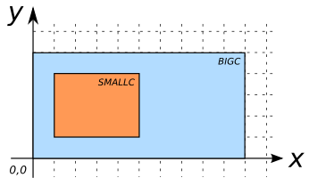

# ST_CoveredBy

## Signature

```sql
BOOLEAN ST_CoveredBy(GEOMETRY geomA, GEOMETRY geomB);
```

## Description

Returns `TRUE` if `geomA` is covered by `geomB` according the following definitions : 

* Every point of this geometry is a point of the other geometry.
* The [DE-9IM](http://en.wikipedia.org/wiki/DE-9IM) Intersection Matrix for the two geometries matches at least one of the following patterns:
```
[T*F**F***]
[*TF**F***]
[**FT*F***]
[**F*TF***]
```

```{include} spatial_indice_warning.md
```

:::{warning}
Operation on mixed SRID geometries is not supported
:::

## Examples

| smallc POLYGON                     | bigc POLYGON                         |
|------------------------------------|--------------------------------------|
| POLYGON((1 1, 5 1, 5 4, 1 4, 1 1)) | POLYGON((0 0, 10 0, 10 5, 0 5, 0 0)) |

{align=center}

```sql
SELECT ST_CoveredBy(smallc, smallc) FROM input_table;
-- Answer:    TRUE
```

```sql
SELECT ST_CoveredBy(smallc, bigc) FROM input_table;
-- Answer:    TRUE
```

```sql
SELECT ST_CoveredBy(bigc, smallc) FROM input_table;
-- Answer:    FALSE
```

```sql
SELECT ST_CoveredBy(bigc, ST_ExteriorRing(bigc)) FROM input_table;
-- Answer:    FALSE
```

## See also

* [`ST_Covers`](../ST_Covers)
* <a href="https://github.com/orbisgis/h2gis/blob/master/h2gis-functions/src/main/java/org/h2gis/functions/spatial/predicates/ST_CoveredBy.java" target="_blank">Source code</a>
