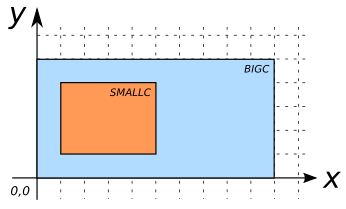

# ST_Covers

## Signature

```sql
BOOLEAN ST_Covers(GEOMETRY geomA, GEOMETRY geomB);
```

## Description

Returns true if no point in `geomB` is outside `geomA`.



## Examples

| smallc POLYGON                     | bigc POLYGON                         |
|------------------------------------|--------------------------------------|
| POLYGON((1 1, 5 1, 5 4, 1 4, 1 1)) | POLYGON((0 0, 10 0, 10 5, 0 5, 0 0)) |



```sql
SELECT ST_Covers(smallc, smallc) FROM input_table;
-- Answer:    TRUE

SELECT ST_Covers(smallc, bigc) FROM input_table;
-- Answer:    FALSE

SELECT ST_Covers(bigc, smallc) FROM input_table;
-- Answer:    TRUE

SELECT ST_Covers(bigc, ST_ExteriorRing(bigc)) FROM input_table;
-- Answer:    TRUE

SELECT ST_Contains(bigc, ST_ExteriorRing(bigc)) FROM input_table;
-- Answer:    FALSE
```

## See also

* <a href="https://github.com/orbisgis/h2gis/blob/master/h2gis-functions/src/main/java/org/h2gis/functions/spatial/predicates/ST_Covers.java" target="_blank">Source code</a>
