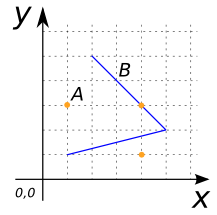
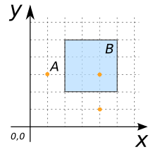
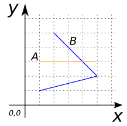
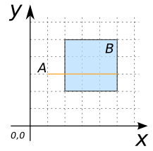
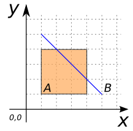
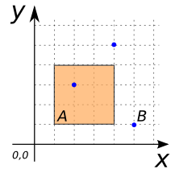
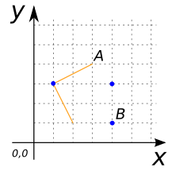
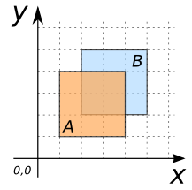
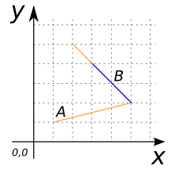

# ST_Crosses

## Signature

```sql
BOOLEAN ST_Crosses(GEOMETRY geomA, GEOMETRY geomB);
```

## Description

Returns true if `geomA` crosses `geomB`.

Crosses means that:

* The intersection between `geomA` and `geomB` gives a new Geometry
  whose dimension is less than the maximum dimension of the input
  Geometries.
* `geomA` and `geomB` have some, but not all interior points in
  common.
* The intersection set is interior to both `geomA` and `geomB`.

```{include} sfs-1-2-1.md
```
```{include} spatial_indice_warning.md
```

### Note
In the OpenGIS Simple Features Specification this predicate is only defined for `(POINT, LINESTRING)`, `(POINT, POLYGON)`, `(LINESTRING, LINESTRING)`, and `(LINESTRING, POLYGON)` situations.

JTS and Geos extend this definition to `(POLYGON, LINESTRING)`, `(POLYGON, POINT)` and `(LINESTRING, POINT)` situations.

## Examples

### Cases where `ST_Crosses` is true

```sql
SELECT ST_Crosses(geomA, geomB) FROM input_table;
-- Answer:    TRUE
```

| geomA MULTIPOINT                 | geomB LINESTRING           |
|----------------------------------|----------------------------|
| MULTIPOINT((1 3), (4 1), (4 3))  | LINESTRING(1 1, 5 2, 2 5)  |

{align=center}

| geomA MULTIPOINT                 | geomB POLYGON                       |
|----------------------------------|-------------------------------------|
| MULTIPOINT((1 3), (4 1), (4 3))  | POLYGON((2 2, 5 2, 5 5, 2 5, 2 2))  |

{align=center}

| geomA LINESTRING      | geomB LINESTRING           |
|-----------------------|----------------------------|
| LINESTRING(1 3, 5 3)  | LINESTRING(1 1, 5 2, 2 5)  |

{align=center}

| geomA LINESTRING      | geomB POLYGON                       |
|-----------------------|-------------------------------------|
| LINESTRING(1 3, 5 3)  | POLYGON((2 2, 5 2, 5 5, 2 5, 2 2))  |

{align=center}

| geomA POLYGON                       | geomB LINESTRING      |
|-------------------------------------|-----------------------|
| POLYGON((1 1, 4 1, 4 4, 1 4, 1 1))  | LINESTRING(1 5, 5 1)  |

{align=center}

| geomA POLYGON                       | geomB MULTIPOINT                 |
|-------------------------------------|----------------------------------|
| POLYGON((1 1, 4 1, 4 4, 1 4, 1 1))  | MULTIPOINT((2 3), (4 5), (5 1))  |

{align=center}

| geomA LINESTRING           | geomB MULTIPOINT                 |
|----------------------------|----------------------------------|
| LINESTRING(2 1, 1 3, 3 4)  | MULTIPOINT((1 3), (4 1), (4 3))  |

{align=center}

### Cases where `ST_Crosses` is false

```sql
SELECT ST_Crosses(geomA, geomB) FROM input_table;
-- Answer:    FALSE
```

| geomA POLYGON                       | geomB POLYGON                       |
|-------------------------------------|-------------------------------------|
| POLYGON((1 1, 4 1, 4 4, 1 4, 1 1))  | POLYGON((2 2, 5 2, 5 5, 2 5, 2 2))  |

{align=center}

| geomA POLYGON              | geomB POLYGON         |
|----------------------------|-----------------------|
| LINESTRING(1 1, 5 2, 2 5)  | LINESTRING(3 4, 5 2)  |

{align=center}

## See also

* [`ST_Intersects`](../ST_Intersects), [`ST_Touches`](../ST_Touches), [`ST_Overlaps`](../ST_Overlaps), [`ST_Contains`](../ST_Contains)
* <a href="https://github.com/orbisgis/h2gis/blob/master/h2gis-functions/src/main/java/org/h2gis/functions/spatial/predicates/ST_Crosses.java" target="_blank">Source code</a>
