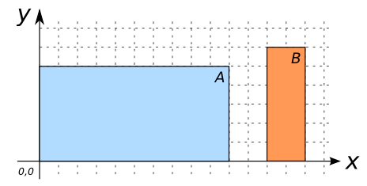

# ST_DWithin

## Signature

```sql
BOOLEAN ST_DWithin(GEOMETRY geomA, GEOMETRY geomB, DOUBLE distance);
```

## Description

Returns true if `geomA` is within `distance` of `geomB`.

## Examples

| geomA POLYGON                        | geomB POLYGON                           |
|--------------------------------------|-----------------------------------------|
| POLYGON((0 0, 10 0, 10 5, 0 5, 0 0)) | POLYGON((12 0, 14 0, 14 6, 12 6, 12 0)) |

{align=center}

```sql
SELECT ST_DWithin(geomA, geomB, 2.0) FROM input_table;
-- Answer:    TRUE

SELECT ST_DWithin(geomA, geomB, 1.0) FROM input_table;
-- Answer:    FALSE

SELECT ST_DWithin(geomA, geomB, -1.0) FROM input_table;
-- Answer:    FALSE

SELECT ST_DWithin(geomA, geomB, 3.0) FROM input_table;
-- Answer:    TRUE

SELECT ST_DWithin(geomA, geomA, -1.0) FROM input_table;
-- Answer:    FALSE

SELECT ST_DWithin(geomA, geomA, 0.0) FROM input_table;
-- Answer:    TRUE

SELECT ST_DWithin(geomA, geomA, 5000.0) FROM input_table;
-- Answer:    TRUE
```

## See also

* <a href="https://github.com/orbisgis/h2gis/blob/master/h2gis-functions/src/main/java/org/h2gis/functions/spatial/predicates/ST_DWithin.java" target="_blank">Source code</a>
