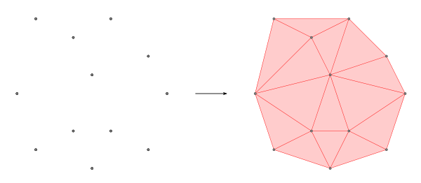
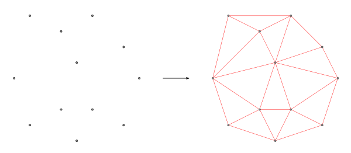
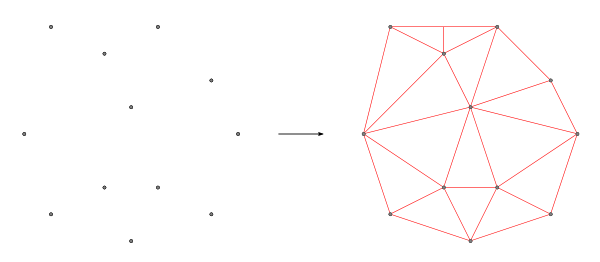

# ST_Delaunay

## Signatures

```sql
GEOMETRY ST_Delaunay(GEOMETRY geom)
GEOMETRY ST_Delaunay(GEOMETRY geom, INTEGER flag)
GEOMETRY ST_Delaunay(GEOMETRY geom, INTEGER flag, DOUBLE quality)
```

## Description
Returns a `MULTIPOLYGON` (or a `MULTILINESTRING`) that represent a Delaunay triangulation constructed from a collection of `POINT`s.

If `flag=0` *(default value)* the output is a collection of `POLYGON`. 
If `flag=1`, a `MULTILINESTRING` is returned. 

The last argument can be set to improve the `quality` of the triangulation. The value must be comprised between 0 and 1. If `quality > 0.6`, we assume that the triangle's quality is acceptable.

### Remarks
* Input geometry (`geom`) can be a `POINT`, a `LINESTRING` or a `POLYGON`. Nevertheless, for good practice reasons, the user may use this function only with `POINT`s. To process `LINESTRING`s and `POLYGON`s it's preferable to use [`ST_ConstrainedDelaunay`](../ST_ConstrainedDelaunay).

* Note that the triangulation doesn't compute the intersections between lines; it takes only existing coordinates.


## Examples

### 1rst signature
```sql
SELECT ST_Delaunay('MULTIPOINT((1 1), (0 4), (3 2), (3 7), (4 5),
                               (5 2), (7 1), (7 6), (8 4), (5 8),
                               (1 8), (4 0))');
-- Answer: 
MULTIPOLYGON (((1 8, 0 4, 3 7, 1 8)), ((1 8, 3 7, 5 8, 1 8)),
	      ((5 8, 3 7, 4 5, 5 8)), ((5 8, 4 5, 7 6, 5 8)),
	      ((7 6, 4 5, 8 4, 7 6)), ((8 4, 4 5, 5 2, 8 4)),
	      ((8 4, 5 2, 7 1, 8 4)), ((4 0, 7 1, 5 2, 4 0)),
	      ((4 0, 5 2, 3 2, 4 0)), ((4 0, 3 2, 1 1, 4 0)),
	      ((1 1, 3 2, 0 4, 1 1)), ((0 4, 3 2, 4 5, 0 4)),
	      ((0 4, 4 5, 3 7, 0 4)), ((4 5, 3 2, 5 2, 4 5)))
```



### 2nd signature with `flag` parameter
```sql
SELECT ST_Delaunay('MULTIPOINT((1 1), (0 4), (3 2), (3 7), (4 5),
                               (5 2), (7 1), (7 6), (8 4), (5 8),
                               (1 8), (4 0))'
		    ,1);
-- Answer: 
MULTILINESTRING ((7 6, 8 4), (5 8, 7 6), (1 8, 5 8), (0 4, 1 8), 
		 (0 4, 1 1), (1 1, 4 0), (4 0, 7 1), (7 1, 8 4),
		 (5 2, 7 1), (5 2, 8 4), (4 5, 5 2), (4 5, 8 4),
		 (4 5, 7 6), (4 5, 5 8), (3 7, 4 5), (3 7, 5 8),
		 (1 8, 3 7), (0 4, 3 7), (0 4, 4 5), (3 2, 4 5),
		 (0 4, 3 2), (1 1, 3 2), (3 2, 4 0), (3 2, 5 2),
		 (4 0, 5 2))
```



### 3rd signature with `flag` and `quality` parameters
```sql
SELECT ST_Delaunay('MULTIPOINT((1 1), (0 4), (3 2), (3 7), (4 5),
                               (5 2), (7 1), (7 6), (8 4), (5 8),
                               (1 8), (4 0))'
		    , 1, 0.5);
-- Answer: 
MULTILINESTRING ((0 4, 1 1), (0 4, 1 8), (0 4, 3 2), (1 1, 3 2), 
		 (0 4, 3 7), (0 4, 4 5), (1 8, 3 7), (1 1, 4 0),
		 (3 2, 4 0), (3 2, 4 5), (3 2, 5 2), (3 7, 4 5),
		 (4 0, 5 2), (4 5, 5 2), (4 5, 8 4), (4 5, 5 8),
		 (3 7, 5 8), (3 8, 5 8), (4 0, 7 1), (5 2, 7 1),
		 (4 5, 7 6), (5 2, 8 4), (5 8, 7 6), (7 1, 8 4),
		 (7 6, 8 4), (3 7, 3 8), (1 8, 3 8))
```



## See also

* [`ST_ConstrainedDelaunay`](../ST_ConstrainedDelaunay), [`ST_Tessellate`](../ST_Tessellate)

* <a href="https://github.com/orbisgis/h2gis/blob/master/h2gis-functions/src/main/java/org/h2gis/functions/spatial/mesh/ST_Delaunay.java" target="_blank">Source code</a>
