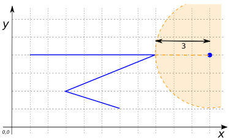
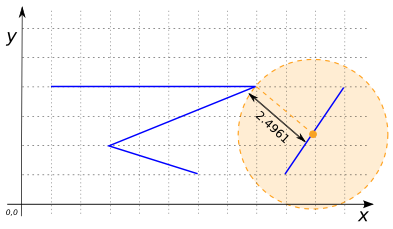
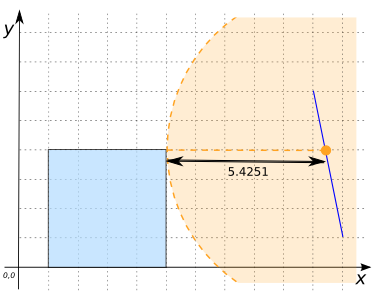
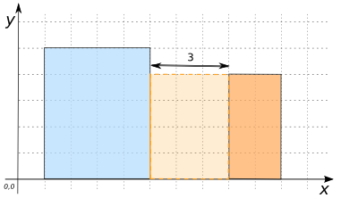

# ST_Distance

## Signature

```sql
DOUBLE ST_Distance(GEOMETRY geomA, GEOMETRY geomB);
```

## Description

Returns the 2-dimensional minimum Cartesian distance between two Geometries in
projected units (spatial reference units).

```{include} sfs-1-2-1.md
```

## Examples

```sql
SELECT ST_Distance('POINT(11 4)',
                   'LINESTRING(1 4, 8 4, 3 2, 6 1)');
-- Answer: 3.0
```



```sql
SELECT ST_Distance('LINESTRING(11 4, 9 1)',
                   'LINESTRING(1 4, 8 4, 3 2, 6 1)');
-- Answer: 2.496150883013531
```



```sql
SELECT ST_Distance('LINESTRING(10 7, 11 1)',
                   'POLYGON((1 0, 1 4, 5 4, 5 0, 1 0))');
-- Answer: 5.42516658107679
```



```sql
SELECT ST_Distance('POLYGON((8 0, 8 4, 10 4, 10 0, 8 0))',
                   'POLYGON((1 0, 1 4, 5 4, 5 0, 1 0))');
-- Answer: 3.0
```



## See also

* <a href="https://github.com/orbisgis/h2gis/blob/master/h2gis-functions/src/main/java/org/h2gis/functions/spatial/properties/ST_Distance.java" target="_blank">Source code</a>
