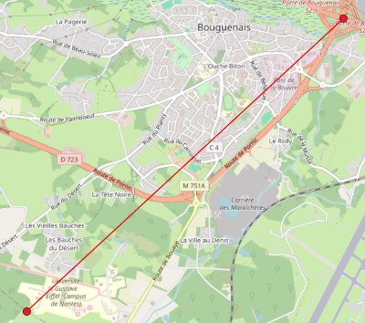

# ST_DistanceSphere

## Signature

```sql
DOUBLE ST_DistanceSphere(GEOMETRY geomA, GEOMETRY geomB);
```

## Description

Returns minimum distance (in meters) between two geometries `geomA` and `geomB`, having coordinates exprimed in `Longitude`/`Latitude`. 

To do so, this function uses a spherical earth and radius derived from the spheroid defined by the SRID. If not specified, [WGS84 - EPSG:4326](https://spatialreference.org/ref/epsg/4326/) is applied by default.

:::{warning}
`geomA` and `geomB` must have the same SRID
:::

## Examples

### `POINT` to `POINT`

```sql
SELECT ST_DistanceSphere('POINT(-1.64993 47.15329)', 
                         'POINT(-1.60727 47.18009)');
-- Answer: 4391.041627411531
```

{align=center}


### `POINT` to `POINT` defining `SRID`

```sql
SELECT ST_DistanceSphere(ST_SetSRID('POINT(-1.64993 47.15329)', 4326), 
                         ST_SetSRID('POINT(-1.60727 47.18009)', 4326));
-- Answer: 4391.041627411531
```
### `POINT` to `LINESTRING`


```sql
SELECT ST_DistanceSphere('POINT(0 0)', 
                         'LINESTRING (10 5, 10 10)');     
-- Answer: 1241932.5985221416
```

### `POINT` to `POLYGON`

```sql
SELECT ST_DistanceSphere('POINT(0 0)', 
                         'POLYGON((1 1,10 0,10 10,0 10,1 1))'); 
-- Answer: 157249.5977685051
```
### `LINESTRING` to `POINT`

```sql
SELECT ST_DistanceSphere('LINESTRING (10 5, 10 10)', 
                         'POINT(0 0)');    
-- Answer: 1241932.5985221416
```

### `LINESTRING` to `LINESTRING`

```sql
SELECT ST_DistanceSphere('LINESTRING (10 5, 10 10)', 
                         'LINESTRING(0 0, 1 1)')
-- Answer: 1093701.742472634
```

### `LINESTRING` to `POLYGON`

```sql
SELECT ST_DistanceSphere('LINESTRING (100 50, 50 50)', 
                         'POLYGON((1 1,10 0,10 10,0 10,1 1),(5 5,7 5,7 7,5 7, 5 5))');
-- Answer: 5763657.991914633
```

### `POLYGON` to `LINESTRING`

```sql
SELECT ST_DistanceSphere('POLYGON((1 1,10 0,10 10,0 10,1 1))', 
                         'LINESTRING (1 10, 10 10)');
-- Answer: 0.0
```

### `POLYGON` to `POLYGON`

```sql
SELECT ST_DistanceSphere('POLYGON ((130 390, 280 390, 280 210, 130 210, 130 390))', 
                         'POLYGON((1 1,10 0,10 10,0 10,1 1),(5 5,7 5,7 7,5 7, 5 5))');
-- Answer: 8496739.27764427
```

## See also

* [`ST_Distance`](../ST_Distance)
* <a href="https://github.com/orbisgis/h2gis/blob/master/h2gis-functions/src/main/java/org/h2gis/functions/spatial/properties/ST_DistanceSphere.java" target="_blank">Source code</a>
