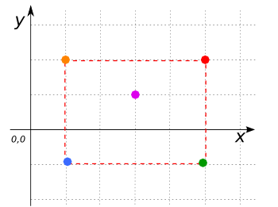
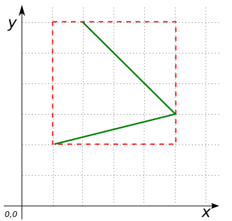

# ST_Envelope

## Signatures

```sql
GEOMETRY ST_Envelope(GEOMETRY geom);
GEOMETRY ST_Envelope(GEOMETRY geom, INT srid);
GEOMETRY ST_Envelope(GEOMETRYCOLLECTION geom);
GEOMETRY ST_Envelope(GEOMETRYCOLLECTION geom, INT srid);
```

## Description

Returns the envelope of `geom` as a Geometry, optionally setting its SRID to
`srid`. The default SRID is the same as that of `geom`.

| Input type                 | Return type                                                                                 |
|----------------------------|---------------------------------------------------------------------------------------------|
| A `POINT`                  | `POINT`                                                                                     |
| A line parallel to an axis | A two-vertex `LINESTRING`                                                                   |
| Otherwise                  | A `POLYGON` whose coordinates are `(minx miny, maxx miny, maxx maxy, minx maxy, minx miny)` |

```{include} sfs-1-2-1.md
```
<!-- Is this function also SQL-MM? -->

## Examples

The envelope of a point is a point
```sql
SELECT ST_Envelope('POINT(1 2)', 2154);
-- Answer: POINT(1 2)
```

This is a line parallel to the x-axis, so only the endpoints are conserved
```sql
SELECT ST_Envelope('LINESTRING(1 1, 5 1, 9 1)');
-- Answer: LINESTRING(1 1, 9 1)
```

(minx miny, maxx miny, maxx maxy, minx maxy, minx miny)
```sql
SELECT ST_Envelope('MULTIPOINT(1 2, 3 1, 2 2, 5 1, 1 -1)');
-- Answer: POLYGON((1 -1, 1 2, 5 2, 5 -1, 1 -1))
```

{align=center}

(minx miny, maxx miny, maxx maxy, minx maxy, minx miny)
```sql
SELECT ST_Envelope('LINESTRING(1 2, 5 3, 2 6)');
-- Answer: POLYGON((1 2, 1 6, 5 6, 5 2, 1 2))
```

{align=center}

### Setting or preserving the SRID

This shows that `ST_Envelope` preserves the SRID of the input geometry
```sql
SELECT ST_SRID(ST_Envelope(
    ST_GeomFromText('LINESTRING(1 1, 5 5)', 27572)))
-- Answer: 27572
```

This shows that `ST_Envelope` can set the SRID of Envelope
```sql
SELECT ST_SRID(ST_Envelope(
    ST_GeomFromText('LINESTRING(1 1, 5 5)', 27572), 2154))
-- Answer: 2154
```

### Comparison with [`ST_Extent`](../ST_Extent)

```{include} extent-envelope-cf.md
```

### Comparison with [`ST_MinimumRectangle`](../ST_MinimumRectangle)

```{include} minimumrectangle-envelope-cf.md
```

## See also

* [`ST_EnvelopeAsText`](../ST_EnvelopeAsText),
  [`ST_Extent`](../ST_Extent),
  [`ST_EstimatedExtent`](../ST_EstimatedExtent),
  [`ST_MinimumRectangle`](../ST_MinimumRectangle),
  [`ST_OctogonalEnvelope`](../ST_OctogonalEnvelope)
* JTS [Geometry#getEnvelope][jts]
* <a href="https://github.com/orbisgis/h2gis/blob/master/h2gis-functions/src/main/java/org/h2gis/functions/spatial/properties/ST_Envelope.java" target="_blank">Source code</a>

[jts]: http://tsusiatsoftware.net/jts/javadoc/com/vividsolutions/jts/geom/Geometry.html#getEnvelope()
