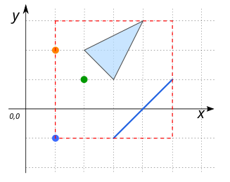

# ST_EnvelopeAsText

## Signature

```sql
VARCHAR ST_EnvelopeAsText(GEOMETRY geom);
```

## Description

Return a string representation of the envelope of `geom` : West, South, East, North &rarr; X<sub>Min</sub>, Y<sub>Min</sub>, X<sub>Max</sub>, Y<sub>Max</sub>.

## Examples

### With a `POINT` 

```sql
SELECT ST_EnvelopeAsText('POINT(1 2)');
-- Answer: 1.0,2.0,1.0,2.0
```
### With a `LINESTRING`

```sql
SELECT ST_EnvelopeAsText('LINESTRING(1 1, 5 5)');
-- Answer: 1.0,1.0,5.0,5.0
```

### With a `LINESTRING` parallel to the x-axis

```sql
SELECT ST_EnvelopeAsText('LINESTRING(1 1, 5 1, 9 1)');
-- Answer: 1.0,1.0,9.0,1.0
```

### With a `MULTIPOINT`

```sql
SELECT ST_EnvelopeAsText('MULTIPOINT(1 2, 3 1, 2 1, 5 1, 1 -1)');
-- Answer: 1.0,-1.0,5.0,2.0
```

{align=center}


### With a `GEOMETRYCOLLECTION`

```sql
SELECT ST_EnvelopeAsText('GEOMETRYCOLLECTION(
                               MULTIPOINT(1 2, 2 1, 1 -1),
                               LINESTRING(3 -1, 5 1),
                               POLYGON((2 2, 4 3, 3 1, 2 2)))');
-- Answer: 1.0,-1.0,5.0,3.0
```
{align=center}

## See also

* [`ST_Envelope`](../ST_Envelope), [`ST_Extent`](../ST_Extent), [`ST_EstimatedExtent`](../ST_EstimatedExtent), [`ST_MinimumRectangle`](../ST_MinimumRectangle),
  [`ST_OctogonalEnvelope`](../ST_OctogonalEnvelope)
* <a href="https://github.com/orbisgis/h2gis/blob/master/h2gis-functions/src/main/java/org/h2gis/functions/spatial/others/ST_EnvelopeAsText.java" target="_blank">Source code</a>

