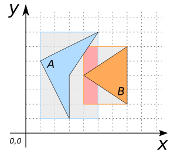
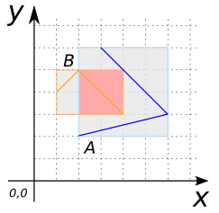
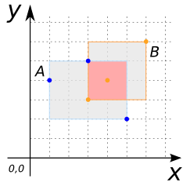
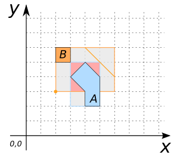
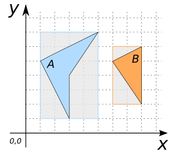

# ST_EnvelopesIntersect

## Signatures

```sql
BOOLEAN ST_EnvelopesIntersect(GEOMETRY geomA, GEOMETRY geomB);
```

## Description

Returns true if the envelope of `geomA` intersects the envelope of `geomA`.

As a consequence, if `ST_Intersects(geomA, geomB)` is true, then
`ST_EnvelopesIntersect(geomA, geomB)` is true.

<!-- This function does not seem to be SFS. Is it SQL-MM? -->

## Examples

### Cases where `ST_EnvelopesIntersect` is true

```sql
SELECT ST_EnvelopesIntersect(geomA, geomB) FROM input_table;
-- Answer:    TRUE
```

| geomA POLYGON | geomB POLYGON |
| ----|---- |
| POLYGON((3 1, 3 4, 5 7, 1 5, 3 1))  | POLYGON((7 2, 7 6, 4 4, 7 2))  |



| geomA LINESTRING | geomB LINESTRING |
| ----|---- |
| LINESTRING(2 2, 6 3, 3 6)  | LINESTRING(1 4, 2 5, 4 3)  |



| geomA MULTIPOINT | geomB MULTIPOINT |
| ----|---- |
| MULTIPOINT((1 4), (3 5), (5 2))  | MULTIPOINT((3 3), (4 4), (6 6))  |



| geomA POLYGON | geomB GEOMETRYCOLLECTION |
| ----|---- |
| POLYGON((4 2, 5 2, 5 4, 4 5, 3 4, 4 3, 4 2))  | GEOMETRYCOLLECTION(POINT(2 3), LINESTRING(6 4, 4 6), POLYGON((2 5, 3 5, 3 6, 2 6, 2 5)))  |



### Cases where `ST_EnvelopesIntersect` is false

```sql
SELECT ST_EnvelopesIntersect(geomA, geomB) FROM input_table;
-- Answer:    FALSE
```

| geomA POLYGON | geomB POLYGON |
| ----|---- |
| POLYGON((3 1, 3 4, 5 7, 1 5, 3 1))  | POLYGON((8 2, 8 6, 6 5, 8 2))  |



## See also

* [`ST_Intersects`](../ST_Intersects), [`ST_Envelope`](../ST_Envelope)
* <a href="https://github.com/orbisgis/h2gis/blob/master/h2gis-functions/src/main/java/org/h2gis/functions/spatial/predicates/ST_EnvelopesIntersect.java" target="_blank">Source code</a>
