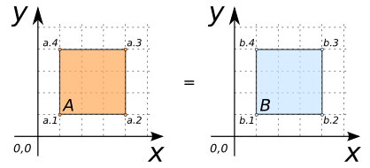
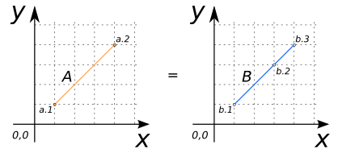

# ST_Equals

## Signature

```sql
BOOLEAN ST_Equals(GEOMETRY geomA, GEOMETRY geomB);
```

## Description

Return `TRUE` if `geomA` is topologically equal to `geomB`.

Equal means:

* Shapes of `geomA` and `geomB` have exactly the same shape. I.e.,
  `ST_Within(A, B) = true` and `ST_Within(B, A) = true`.
* The directionality and the order of points is ignored.

```{include} sfs-1-2-1.md
```

```{include} spatial_indice_warning.md
```

## Examples

### Cases where `ST_Equals` is true

```sql
SELECT ST_Equals(geomA, geomB) FROM input_table;
-- Answer:    TRUE
```

| geomA POLYGON                       | geomB POLYGON                       |
|-------------------------------------|-------------------------------------|
| POLYGON((1 1, 4 1, 4 4, 1 4, 1 1))  | POLYGON((1 1, 4 1, 4 4, 1 4, 1 1))  |

{align=center}

| geomA POLYGON                       | geomB POLYGON                       |
|-------------------------------------|-------------------------------------|
| POLYGON((1 1, 4 1, 4 4, 1 4, 1 1))  | POLYGON((4 4, 4 1, 1 1, 1 4, 4 4))  |

{align=center}

| geomA LINESTRING      | geomB LINESTRING           |
|-----------------------|----------------------------|
| LINESTRING(1 1, 4 4)  | LINESTRING(1 1, 3 3, 4 4)  |

{align=center}

## See also

* [`ST_OrderingEquals`](../ST_OrderingEquals),
  [`ST_Relate`](../ST_Relate),
  [`ST_Within`](../ST_Within)
* <a href="https://github.com/orbisgis/h2gis/blob/master/h2gis-functions/src/main/java/org/h2gis/functions/spatial/predicates/ST_Equals.java" target="_blank">Source code</a>
