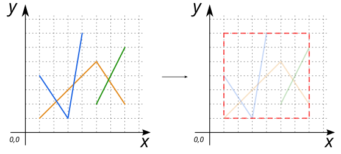
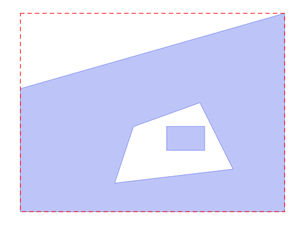

# ST_EstimatedExtent

## Signatures

```sql
GEOMETRY ST_EstimatedExtent(VARCHAR tableName);
GEOMETRY ST_EstimatedExtent(VARCHAR tableName, VARCHAR geometryColumn);
```

## Description

Return the 'estimated' extent of the given spatial table (`tableName`).

The Extent is first calculated from the spatial index of the table *(if there is one)*.

If the pointed geometry column (`geometryColumn`) doesn't have a spatial index, then the extent is based on all geometries.

This function is fast, but estimation may include uncommitted data (including data from other transactions), and may return approximate bounds, or be different with actual value due to other reasons.

:::{warning}
Only 2D coordinate (`XY`) is supported
:::

## Examples

### Case with `tableName`

```sql
DROP TABLE IF EXISTS myTable;
CREATE TABLE myTable (THE_GEOM GEOMETRY(LINESTRING));

INSERT INTO myTable VALUES('LINESTRING(1 1, 5 5, 7 2)'::GEOMETRY), 
                          ('LINESTRING(1 4, 3 1, 4 7)'::GEOMETRY),
                          ('LINESTRING(5 2, 7 6)'::GEOMETRY);

SELECT ST_EstimatedExtent('myTable');
-- Answer: POLYGON ((1 1, 1 7, 7 7, 7 1, 1 1)) (red dashed line)
```

{align=center}

### Case with `tableName` and `geometryColumn`

```sql
DROP TABLE IF EXISTS myTable;
CREATE TABLE myTable (THE_GEOM GEOMETRY(MULTIPOLYGON, 4326));

INSERT INTO myTable VALUES(ST_MPolyFromText('
      MULTIPOLYGON(((28 26,28 0,84 0, 84 42,28 26), (52 18,66 23,73 9,48 6,52 18)),
                   ((59 18,67 18,67 13,59 13,59 18)))', 4326));

SELECT ST_EstimatedExtent('myTable', 'THE_GEOM');

-- Answer: SRID=4326;POLYGON ((28 0, 28 42, 84 42, 84 0, 28 0)) (red dashed line)
```
{align=center}


## See also

* [`ST_Extent`](../ST_Extent), 
  [`ST_Envelope`](../ST_Envelope),
  [`ST_MinimumRectangle`](../ST_MinimumRectangle),
  [`ST_OctogonalEnvelope`](../ST_OctogonalEnvelope)
* <a href="https://github.com/orbisgis/h2gis/blob/master/h2gis-functions/src/main/java/org/h2gis/functions/spatial/properties/ST_EstimatedExtent.java" target="_blank">Source code</a>
