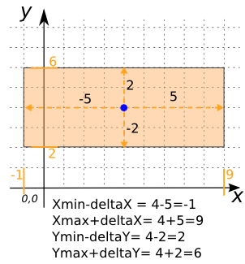
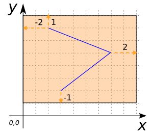
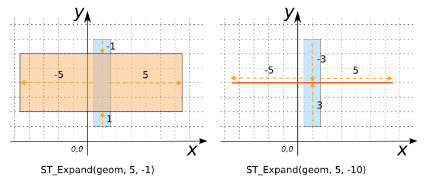
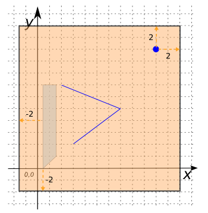

# ST_Expand

## Signatures

```sql
GEOMETRY ST_Expand(GEOMETRY geom, DOUBLE distance);
GEOMETRY ST_Expand(GEOMETRY geom, DOUBLE deltaX, DOUBLE deltaY);
```

## Description

Returns a Geometry's envelope expanded by a `distance` or `delta X` and `delta Y`.
Both positive and negative distances are supported.
In case of `distance`, the same value is applied in `delta X` and `delta Y`.

## Examples

### With `distance`

```sql
SELECT ST_Expand('POINT(4 4)', 2);
-- Answer: POLYGON ((2 2, 2 6, 6 6, 6 2, 2 2)) 
```

### With `deltaX` and `deltaY`

```sql
SELECT ST_Expand('POINT(4 4)', 5, 2);
-- Answer: POLYGON((-1 2, -1 6, 9 6, 9 2, -1 2))
```

{align=center}

```sql
SELECT ST_Expand('LINESTRING(3 2, 7 5, 2 7)', 2, 1);
-- Answer: POLYGON((0 1, 0 8, 9 8, 9 1, 0 1))
```

{align=center}

```sql
SELECT ST_Expand('POLYGON((0.5 1, 0.5 7, 1.5 7, 1.5 1, 0.5 1))',
                 5, -1);
-- ANswer: POLYGON((-4.5 2, -4.5 6, 6.5 6, 6.5 2, -4.5 2))

-- In this example, |deltaY| > ymax-ymin, so ST_Expand uses a deltaY
-- of (ymax-ymin)/2.
SELECT ST_Expand('POLYGON((0.5 1, 0.5 7, 1.5 7, 1.5 1, 0.5 1))',
                 5, -10);
-- Answer: LINESTRING(-4.5 4, 6.5 4)
```

{align=center}

```sql
SELECT ST_Expand('GEOMETRYCOLLECTION(
                   LINESTRING(3 2, 7 5, 2 7),
                   POINT(10 10),
                   POLYGON((0.5 0, 0.5 7, 1.5 7, 1.5 1, 0.5 0)))',
                 2, 2);
-- Answer: POLYGON((-1.5 -2, -1.5 12, 12 12, 12 -2, -1.5 -2))
```

{align=center}

## See also

* [`ST_Buffer`](../ST_Buffer)
* <a href="https://github.com/orbisgis/h2gis/blob/master/h2gis-functions/src/main/java/org/h2gis/functions/spatial/create/ST_Expand.java" target="_blank">Source code</a>
