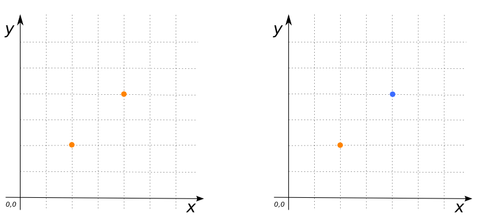

# ST_Explode

## Signature

```sql
tableName[*, explod_id] ST_Explode('tableName');
tableName[*, explod_id] ST_Explode('query');
tableName[*, explod_id] ST_Explode('tableName', 'fieldName');
tableName[*, explod_id] ST_Explode('query', 'fieldName');
```

## Description
Explodes the `GEOMETRYCOLLECTION`s in the `fieldName` column of table `tableName`, or in a `query`, into multiple Geometries.

If no field name is specified, the first Geometry column is used.

The select `query` must be enclosed in parenthesis `()`.

## Examples

```sql
CREATE TABLE test_point AS SELECT
    'MULTIPOINT((1 1), (2 2))'::Geometry as THE_GEOM;
```

### With the `tableName`
```sql
SELECT * FROM ST_Explode('test_point');
```

### With a `query`
```sql
SELECT * FROM ST_Explode('(SELECT * FROM test_point WHERE ST_Dimension(THE_GEOM)=0)');

-- Answer:
--    |   THE_GEOM  | EXPLOD_ID |
--    | ------------|-----------|
--    | POINT(1 1)  |     1     |
--    | POINT(2 2)  |     2     |

```

{align=center}

### With `tableName` and `fieldName`

```sql
CREATE TABLE test_point AS SELECT
    'MULTIPOINT((1 1), (2 2))'::Geometry the_geomA,
    'MULTIPOINT((3 3), (2 6))'::Geometry the_geomB;
SELECT * FROM ST_Explode('test_point', 'the_geomB');
-- Answer:
--    |         THE_GEOMA         | THE_GEOMB   | EXPLOD_ID |
--    |---------------------------|-------------|-----------|
--    | MULTIPOINT((1 1), (2 2))  | POINT(3 3)  |      1    |
--    | MULTIPOINT((1 1), (2 2))  | POINT(2 6)  |      2    |
```

## See also

* <a href="https://github.com/orbisgis/h2gis/blob/master/h2gis-functions/src/main/java/org/h2gis/functions/spatial/properties/ST_Explode.java" target="_blank">Source code</a>
