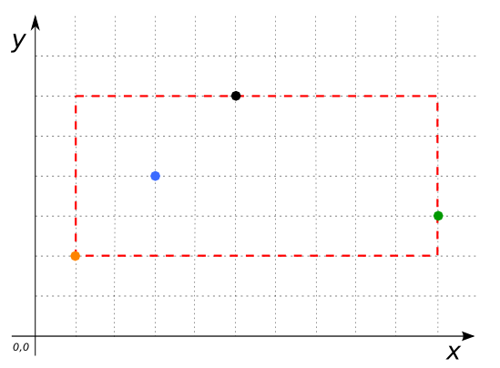

# ST_Extent

## Signatures

```sql
GEOMETRY ST_Extent(GEOMETRY geom);
GEOMETRY ST_Extent(GEOMETRYCOLLECTION geom);
```

## Description

Returns the minimum bounding box that encloses `geom` as a Geometry.

## Examples

```sql
SELECT ST_Extent('MULTIPOINT((5 6), (1 2), (3 4), (10 3))'::Geometry);
-- Answer: POLYGON((1 2, 1 6, 10 6, 10 2, 1 2))
```

{align=center}

```sql
SELECT ST_Extent('POINT(5 6)'::Geometry);
-- Answer: POINT(5 6)
```

### Comparison with [`ST_Envelope`](./ST_Envelope)

```{include} extent-envelope-cf.md
```

## See also

* [`ST_Envelope`](../ST_Envelope),
  [`ST_MinimumRectangle`](../ST_MinimumRectangle),
  [`ST_OctogonalEnvelope`](../ST_OctogonalEnvelope)
* <a href="https://github.com/orbisgis/h2gis/blob/master/h2gis-functions/src/main/java/org/h2gis/functions/spatial/properties/ST_Extent.java" target="_blank">Source code</a>
