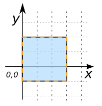
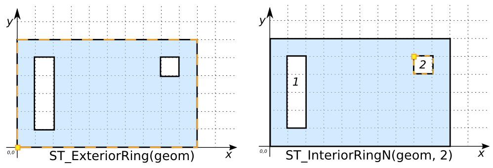

# ST_ExteriorRing

## Signature

```sql
LINEARRING ST_ExteriorRing(GEOMETRY geom);
```

## Description

Returns the exterior ring of `geom` as a `LINEARRING`, or `NULL` if `geom` is
not a `POLYGON`.

```{include} type-warning_multipolygon.md
```

```{include} sfs-1-2-1.md
```

## Examples

```sql
SELECT ST_ExteriorRing('POLYGON((0 -1, 0 2, 3 2, 3 -1, 0 -1))');
-- Answer: LINEARRING(0 -1, 0 2, 3 2, 3 -1, 0 -1)
```

{align=center}

```sql
SELECT ST_ExteriorRing('MULTIPOLYGON(((0 0, 10 0, 5 5, 0 0)),
                                      ((10 0, 5 5, 10 10, 10 0)))');
-- Answer: NULL
```

```sql
SELECT ST_ExteriorRing('POINT(1 2)');
-- Answer: NULL
```

### Comparison with [`ST_InteriorRingN`](../ST_InteriorRingN)

```sql
SELECT ST_ExteriorRing('POLYGON((0 0, 10 0, 10 6, 0 6, 0 0),
                                (1 1, 2 1, 2 5, 1 5, 1 1),
                                (8 5, 8 4, 9 4, 9 5, 8 5))') ER,
       ST_InteriorRingN('POLYGON((0 0, 10 0, 10 6, 0 6, 0 0),
                                (1 1, 2 1, 2 5, 1 5, 1 1),
                                (8 5, 8 4, 9 4, 9 5, 8 5))', 2) IRN;
```

Answer:
|             ER              |            IRN               |
|-----------------------------|------------------------------|
| LINEARRING(0 0, 10 0, 10 6, 0 6, 0 0) | LINEARRING(8 5, 8 4, 9 4, 9 5, 8 5) |

{align=center}

### Comparison with [`ST_Boundary`](../ST_Boundary)

```sql
SELECT ST_ExteriorRing('POLYGON((0 0, 10 0, 10 6, 0 6, 0 0),
                                (1 1, 2 1, 2 5, 1 5, 1 1))') ER,
       ST_Boundary('POLYGON((0 0, 10 0, 10 6, 0 6, 0 0),
                             (1 1, 2 1, 2 5, 1 5, 1 1))') BDRY;
```
Answer:
|              ER             |            BDRY              |
|-----------------------------|------------------------------|
| LINEARRING(0 0, 10 0, 10 6, 0 6, 0 0) | MULTILINESTRING(<br>(0 0, 10 0, 10 6, 0 6, 0 0),<br> (1 1, 2 1, 2 5, 1 5, 1 1))   |

{align=center}

## See also

* [`ST_Boundary`](../ST_Boundary), [`ST_InteriorRingN`](../ST_InteriorRingN)
* <a href="https://github.com/orbisgis/h2gis/blob/master/h2gis-functions/src/main/java/org/h2gis/functions/spatial/properties/ST_ExteriorRing.java" target="_blank">Source code</a>
