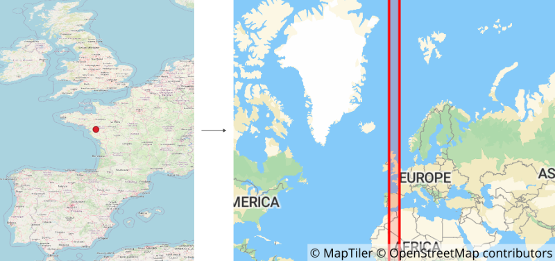

# ST_FindUTMSRID

## Signature

```sql
INT ST_FindUTMSRID(GEOMETRY geom);
```

## Description

Find the [UTM](https://en.wikipedia.org/wiki/Universal_Transverse_Mercator_coordinate_system) SRID code from the centroid of a geometry (`geom`).


## Examples

We have a `POINT`, placed in west of France and which coordinates is `(-1.53391 47.20259)` (in WGS 84 - [EPSG:4326](https://epsg.io/4326))

```sql
SELECT ST_FindUTMSRID('POINT(-1.53391 47.20259)');

-- Answer: 32630
```
Here, [EPSG:32630](https://epsg.io/32630) correspond to WGS 84 / UTM zone 30N.

{align=center}


## See also

* [`ST_SRID`](../ST_SRID), [`ST_SetSRID`](../ST_SetSRID), [`ST_Transform`](../ST_Transform), [`UpdateGeometrySRID`](../UpdateGeometrySRID), [`ST_GeomFromText`](../ST_GeomFromText)
* <a href="https://github.com/orbisgis/h2gis/blob/master/h2gis-functions/src/main/java/org/h2gis/functions/spatial/properties/ST_SRID.java" target="_blank">Source code</a>