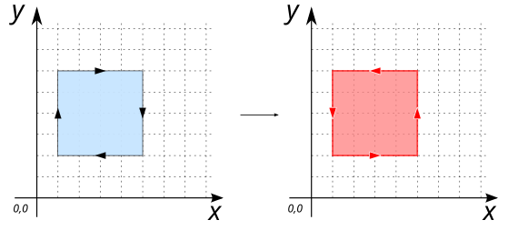
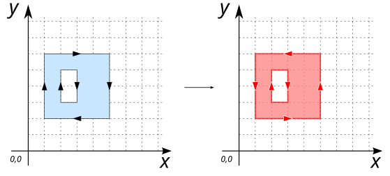

# ST_ForcePolygonCCW

## Signature

```sql
GEOMETRY ST_ForcePolygonCCW(GEOMETRY geom);
```

## Description

Forces (`MULTI`)`POLYGON`'s to have:
* a **counter-clockwise** orientation for their exterior ring, 
* and a **clockwise** orientation for their interior rings.

Non-polygonal geometries are returned unchanged.

## Examples

### With `POLYGON`

```sql
SELECT ST_ForcePolygonCCW('POLYGON ((1 2, 1 6, 5 6, 5 2, 1 2))');

-- Answer: POLYGON((1 2, 5 2, 5 6, 1 6, 1 2))
```

{align=center}

### With `MULTIPOLYGON`

```sql
SELECT ST_ForcePolygonCCW('MULTIPOLYGON (((1 2, 1 6, 5 6, 5 2, 1 2)), 
                                        ((6 4, 6 7, 7 7, 7 4, 6 4)))');

-- Answer: MULTIPOLYGON(((1 2, 5 2, 5 6, 1 6, 1 2)), 
--                      ((6 4, 7 4, 7 7, 6 7, 6 4)))
```

{align=center}

### With interior ring

```sql
SELECT ST_ForcePolygonCCW('POLYGON ((1 2, 1 6, 5 6, 5 2, 1 2), 
                                    (2 3, 3 3, 3 5, 2 5, 2 3))');

-- Answer: POLYGON((1 2, 5 2, 5 6, 1 6, 1 2),
--                 (2 3, 2 5, 3 5, 3 3, 2 3))
```

{align=center}

## See also

* [`ST_ForcePolygonCW`](../ST_ForcePolygonCW)
* <a href="https://github.com/orbisgis/h2gis/blob/master/h2gis-functions/src/main/java/org/h2gis/functions/spatial/edit/ST_ForcePolygonCCW.java" target="_blank">Source code</a>
