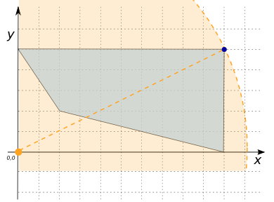
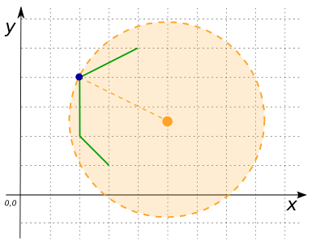
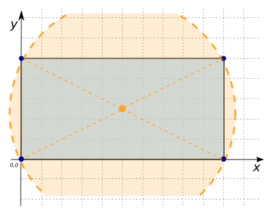

# ST_FurthestCoordinate

## Signatures

```sql
{POINT, MULTIPOINT} ST_FurthestCoordinate(POINT point, GEOMETRY geom);
```

## Description

Returns the coordinate of `geom` furthest from `point` using 2D distances
(z-coordinates are ignored).



## Examples

```sql
SELECT ST_FurthestCoordinate('POINT(0 0)',
                             'POLYGON((2 2, 10 0, 10 5, 0 5, 2 2))');
-- Answer: POINT(10 5)
```

{align=center}

```sql
SELECT ST_FurthestCoordinate('POINT(5 2.5)',
                             'LINESTRING(3 1, 2 2, 2 4, 4 5)');
-- Answer: POINT(2 4)
```

{align=center}

```sql
SELECT ST_FurthestCoordinate('POINT(5 2.5)',
                             'POLYGON((0 0, 10 0, 10 5, 0 5, 0 0))');
-- Answer: MULTIPOINT((10 5), (0 0), (0 5), (10 0))
```

{align=center}

## See also

* [`ST_ClosestCoordinate`](../ST_ClosestCoordinate)
* <a href="https://github.com/orbisgis/h2gis/blob/master/h2gis-functions/src/main/java/org/h2gis/functions/spatial/distance/ST_FurthestCoordinate.java" target="_blank">Source code</a>
