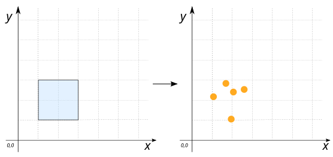
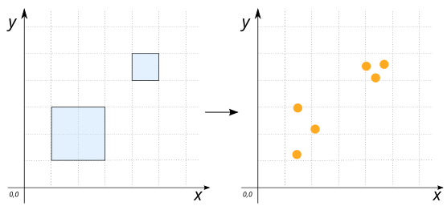

# ST_GeneratePoints

## Signature

```sql
GEOMETRY ST_GeneratePoints(Geometry geom, int nPts)
```

## Description

Generate pseudo-random points until the requested number `nPts` are found, within the input area `geom`.

:::{warning}

The input `geom` has to be `POLYGON` or `MULTIPOLYGON`
:::

## Examples

### With `POLYGON`'s

```sql
SELECT ST_GeneratePoints('POLYGON((1 1, 3 1, 3 3, 1 3, 1 1))', 5);

-- Answer:
-- MULTIPOINT ((1.946512065063848 1.036256112227437), 
--             (2.087936360396987 2.2932662419105783),
--             (1.7849456176630605 2.7467958123141867),
--             (2.561095438013629 2.591437601681318),
--             (1.117277238778494 2.1891297573934008))
```

{align=center}

### With `MULTIPOLYGON`'s

```sql
SELECT ST_GeneratePoints('MULTIPOLYGON(((1 1, 3 1, 3 3, 1 3, 1 1)), 
                                       ((4 4, 5 4, 5 5, 4 5, 4 4)))', 6);

-- Answer:
-- MULTIPOINT ((2.1090076205445163 2.35769409613527), 
--             (4.376530382850671 4.041283435323451),
--             (1.4752469627333262 2.967959780195486),
--             (1.3000195938770318 1.2085256095592416),
--             (4.025271689388456 4.575168776105154),
--             (4.819455180431149 4.626427535954349))
```

{align=center}

## See also

* [`ST_GeneratePointsInGrid`](../ST_GeneratePointsInGrid)
* <a href="https://github.com/orbisgis/h2gis/blob/master/h2gis-functions/src/main/java/org/h2gis/functions/spatial/create/ST_GeneratePoints.java" target="_blank">Source code</a>
