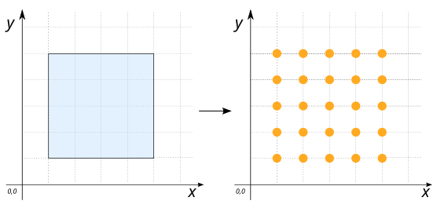
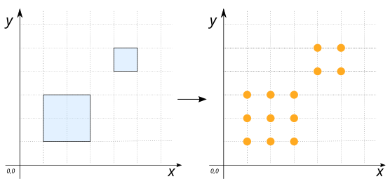

# ST_GeneratePointsInGrid

## Signature

```sql
GEOMETRY ST_GeneratePointsInGrid(Geometry geom, int cellSizeX, int cellSizeY, boolean useMask)
```

## Description

Generate a regular set of points according a `x` and `y` cell sizes.

The `usemask` argument is used to keep the points located inside the input geometry. If `usemask` = `FALSE`, the resulting points may be outside the input geomtry `geom` (depending on its shape).

:::{warning}

The input `geom` has to be `POLYGON` or `MULTIPOLYGON`
:::

## Examples

### With `POLYGON`'s

```sql
SELECT ST_GeneratePointsInGrid('POLYGON((1 1, 5 1, 5 5, 1 5, 1 1))', 1, 1, true);

-- Answer:
-- MULTIPOINT ((1 1), (1 2), (1 3), (1 4), (1 5), (2 1), (2 2), (2 3), (2 4),
--             (2 5), (3 1), (3 2), (3 3), (3 4), (3 5), (4 1), (4 2), (4 3), 
--             (4 4), (4 5), (5 1), (5 2), (5 3), (5 4), (5 5))
```

{align=center}

### With `MULTIPOLYGON`'s

```sql
SELECT ST_GeneratePointsInGrid('MULTIPOLYGON(((1 1, 3 1, 3 3, 1 3, 1 1)),
                                             ((4 4, 5 4, 5 5, 4 5, 4 4)))', 1, 1, true);

-- Answer:
-- MULTIPOINT ((1 1), (1 2), (1 3), (2 1), (2 2), (2 3), (3 1), (3 2), (3 3), 
--             (4 4), (4 5), (5 4), (5 5))
```

{align=center}

### With `usemask`

`usemask` = `TRUE`

```sql
SELECT ST_GeneratePointsInGrid('POLYGON((1 1, 5 1, 5 2, 2 2, 2 4, 5 4, 5 5, 1 5, 1 1))',
                                1, 1, TRUE)

-- Answer:
-- MULTIPOINT ((1 1), (1 2), (1 3), (1 4), (1 5), (2 1), (2 2), (2 3),
--             (2 4), (2 5), (3 1), (3 2), (3 4), (3 5), (4 1), (4 2),
--             (4 4), (4 5), (5 1), (5 2), (5 4), (5 5))
```
`usemask` = `FALSE`

```sql
SELECT ST_GeneratePointsInGrid('POLYGON((1 1, 5 1, 5 2, 2 2, 2 4, 5 4, 5 5, 1 5, 1 1))',
                                1, 1, FALSE

-- Answer:
-- MULTIPOINT ((1 1), (1 2), (1 3), (1 4), (1 5), (2 1), (2 2), (2 3), 
--             (2 4), (2 5), (3 1), (3 2), (3 3), (3 4), (3 5), (4 1), 
--             (4 2), (4 3), (4 4), (4 5), (5 1), (5 2), (5 3), (5 4), (5 5))
```

{align=center}

## See also

* [`ST_GeneratePoints`](../ST_GeneratePoints)
* <a href="https://github.com/orbisgis/h2gis/blob/master/h2gis-functions/src/main/java/org/h2gis/functions/spatial/create/ST_GeneratePointsInGrid.java" target="_blank">Source code</a>
