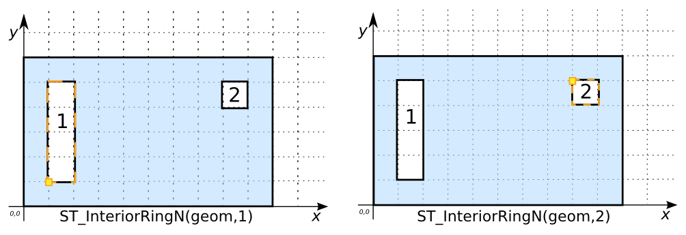

# ST_InteriorRingN

## Signature

```sql
LINESTRING ST_InteriorRing(GEOMETRY geom, INT n);
```

## Description

Returns the *n*th interior ring of `geom` if `geom` is a `POLYGON`. Returns `NULL` otherwise.


```{include} sfs-1-2-1.md
```

## Example

```sql
SELECT ST_InteriorRingN('POLYGON((0 0, 10 0, 10 6, 0 6, 0 0),
                                 (1 1, 2 1, 2 5, 1 5, 1 1),
                                 (8 5, 8 4, 9 4, 9 5, 8 5))', 1);
-- Answer: LINEARRING(1 1, 2 1, 2 5, 1 5, 1 1)

SELECT ST_InteriorRingN('POLYGON((0 0, 10 0, 10 6, 0 6, 0 0),
                                 (1 1, 2 1, 2 5, 1 5, 1 1),
                                 (8 5, 8 4, 9 4, 9 5, 8 5))', 2);
-- Answer: LINEARRING(8 5, 8 4, 9 4, 9 5, 8 5)
```



```sql
SELECT ST_InteriorRingN('POLYGON((0 0, 10 0, 10 6, 0 6, 0 0),
                                 (1 1, 2 1, 2 5, 1 5, 1 1),
                                 (8 5, 8 4, 9 4, 9 5, 8 5))', 3);
-- Answer: Interior ring index out of range. Must be between 1 and
-- ST_NumInteriorRings.

SELECT ST_InteriorRingN('POINT(1 2)', 1);
-- Answer: NULL
```

##### Comparison with [`ST_ExteriorRing`](../ST_ExteriorRing)



## See also

* [`ST_ExteriorRing`](../ST_ExteriorRing)
* <a href="https://github.com/orbisgis/h2gis/blob/master/h2gis-functions/src/main/java/org/h2gis/functions/spatial/properties/ST_InteriorRingN.java" target="_blank">Source code</a>
