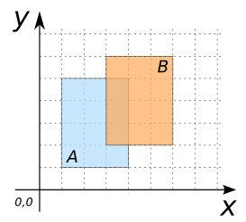
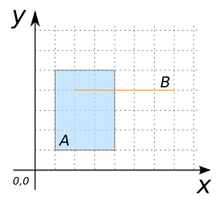
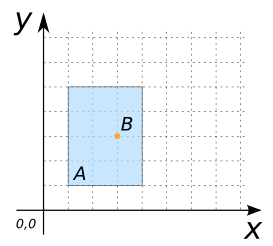
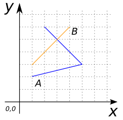
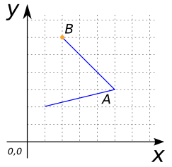
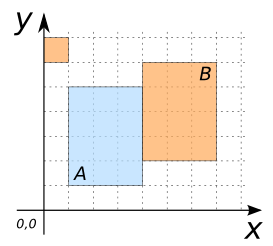
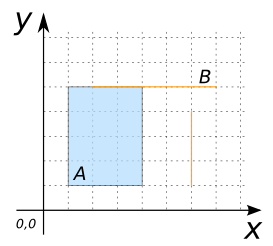
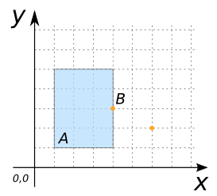
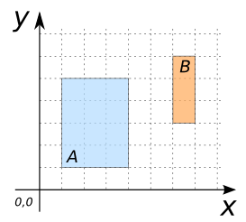

# ST_Intersects

## Signature

```sql
BOOLEAN ST_Intersects(GEOMETRY geomA, GEOMETRY geomB);
```

## Description

Returns `TRUE` if `geomA` intersects `geomB`.

Intersects means that `geomA` and `geomB` have at least one point in common.

```{include} type-warning_geometrycollection.md
```

```{include} sfs-1-2-1.md
```

```{include} spatial_indice_warning.md
```

## Examples

### Cases where `ST_Intersects` is true

```sql
SELECT ST_Intersects(geomA, geomB) FROM input_table;
-- Answer:    TRUE
```

| geomA POLYGON                       | geomB POLYGON                       |
|-------------------------------------|-------------------------------------|
| POLYGON((1 1, 4 1, 4 5, 1 5, 1 1))  | POLYGON((3 2, 6 2, 6 6, 3 6, 3 2))  |

{align=center}

| geomA POLYGON                       | geomB LINESTRING      |
|-------------------------------------|-----------------------|
| POLYGON((1 1, 4 1, 4 5, 1 5, 1 1))  | LINESTRING(2 4, 7 4)  |

{align=center}

| geomA POLYGON                       | geomB POINT |
|-------------------------------------|-------------|
| POLYGON((1 1, 4 1, 4 5, 1 5, 1 1))  | POINT(3 3)  |

{align=center}

| geomA LINESTRING           | geomB LINESTRING      |
|----------------------------|-----------------------|
| LINESTRING(2 1, 5 3, 2 6)  | LINESTRING(1 3, 4 6)  |

{align=center}

| geomA LINESTRING           | geomB POINT |
|----------------------------|-------------|
| LINESTRING(2 1, 5 3, 2 6)  | POINT(2 6)  |

{align=center}

| geomA POLYGON                       | geomB MULTIPOLYGON                                                      |
|-------------------------------------|-------------------------------------------------------------------------|
| POLYGON((1 1, 4 1, 4 5, 1 5, 1 1))  | MULTIPOLYGON(((4 2, 7 2, 7 6, 4 6, 4 2)), ((0 6, 1 6, 1 7, 0 7, 0 6)))  |

{align=center}

| geomA POLYGON                       | geomB MULTILINESTRING                    |
|-------------------------------------|------------------------------------------|
| POLYGON((1 1, 4 1, 4 5, 1 5, 1 1))  | MULTILINESTRING((2 5, 7 5), (6 1, 6 4))  |

{align=center}

| geomA POLYGON                       | geomB MULTIPOINT          |
|-------------------------------------|---------------------------|
| POLYGON((1 1, 4 1, 4 5, 1 5, 1 1))  | MULTIPOINT((4 3), (6 2))  |

{align=center}

### Cases where `ST_Intersects` is false

```sql
SELECT ST_Intersects(geomA, geomB) FROM input_table;
-- Answer:    FALSE
```

| geomA POLYGON                       | geomB POLYGON                       |
|-------------------------------------|-------------------------------------|
| POLYGON((1 1, 4 1, 4 5, 1 5, 1 1))  | POLYGON((6 3, 7 3, 7 6, 6 6, 6 3))  |

{align=center}

## See also

* [`ST_Intersection`](../ST_Intersection), [`ST_Overlaps`](../ST_Overlaps), [`ST_Contains`](../ST_Contains), [`ST_Touches`](../ST_Touches)
* <a href="https://github.com/orbisgis/h2gis/blob/master/h2gis-functions/src/main/java/org/h2gis/functions/spatial/predicates/ST_Intersects.java" target="_blank">Source code</a>
